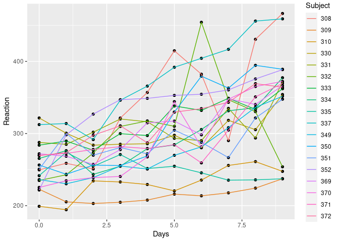
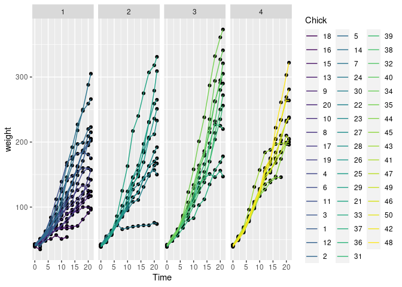

<!-- README.md is generated from README.Rmd. Please edit only README.Rmd! -->

# `pbkrtest`: Parametric Bootstrap, Kenward-Roger and Satterthwaite Based Methods for Mixed Model Comparison

Attention is on mixed effects models (as implemented in the ‘lme4’
package). For linear mixed models, ‘pbkrtest’ implements the following
tests for fixed effects:

1.  a parametric bootstrap test,
2.  a Kenward-Roger-type F-test and
3.  a Satterthwaite-type F-test.

For generalized linear mixed models (as implemented in ‘lme4’) and for
generalized linear models, ‘pbkrtest’ implements

1.  a parametric bootstrap test

The facilities of the package are documented in the paper by Halekoh and
Højsgaard, (2012, ).

Please see ‘citation(“pbkrtest”)’ for information about citing the paper
and the package. If you use the package in your work, please do cite the
2012-paper. There are other packages that use ‘pbkrtest’ under the hood.
If you use one of those packages, please do also cite our 2012 paper.

Documents:

1.  [Halekoh and Højsgaard (2012) A Kenward-Roger Approximation and
    Parametric Bootstrap Methods for Tests in Linear Mixed Models The R
    Package
    pbkrtest](https://www.jstatsoft.org/index.php/jss/article/view/v059i09/v59i09.pdf)
2.  [Vignette: introduction to
    ‘pbkrtest’](https://cran.r-project.org/package=pbkrtest/vignettes/pbkrtest.pdf)
3.  [Webpage for the
    package](https://people.math.aau.dk/~sorenh/software/pbkrtest/index.html)

<!-- badges: start -->

[](https://github.com/hojsgaard/pbkrtest/actions)
[](https://codecov.io/gh/hojsgaard/dlmextra?branch=master)
<!-- badges: end -->

## Installation

`pbkrtest` is available on CRAN and development versions can also be
found on Github:

    ## Install from CRAN:
    install.packages('pbkrtest')
    ## Install from Github:
    # install.packages('remotes')
    remotes::install_github("hojsgaard/pbkrtest", build_vignettes = TRUE)

## Development site

See <https://github.com/hojsgaard/pbkrtest>.

## Online documentation

See <https://hojsgaard.github.io/pbkrtest/>.

## Brief introduction

``` r
library(pbkrtest)
library(ggplot2)

## Sugar beets: Does suger content depend on harvest time?

beets |> ggplot(aes(x=sow, y=sugpct, group=harvest)) +
    geom_jitter(aes(color=harvest), width=0)
```

<!-- -->

``` r

fm0 <- lmer(sugpct ~ block + sow + harvest + (1|block:harvest), data=beets)
fm1 <- update(fm0, .~. -harvest)

## Is there an effect of harvest time?
an <- anova(fm0, fm1)
pb <- PBmodcomp(fm0, fm1)
kr <- KRmodcomp(fm0, fm1)
sa <- SATmodcomp(fm0, fm1)

tidy(an)
#> # A tibble: 2 × 9
#>   term   npar   AIC   BIC logLik deviance statistic    df   p.value
#>   <chr> <dbl> <dbl> <dbl>  <dbl>    <dbl>     <dbl> <dbl>     <dbl>
#> 1 fm1       9 -69.1 -56.5   43.5    -87.1      NA      NA NA       
#> 2 fm0      10 -80.0 -66.0   50.0   -100.       12.9     1  0.000326
tidy(pb)
#> # A tibble: 2 × 4
#>   type    stat    df  p.value
#>   <chr>  <dbl> <dbl>    <dbl>
#> 1 LRT     12.9     1 0.000326
#> 2 PBtest  12.9    NA 0.0340
tidy(kr)
#> # A tibble: 1 × 6
#>   type   stat   ndf   ddf F.scaling p.value
#>   <chr> <dbl> <int> <dbl>     <dbl>   <dbl>
#> 1 Ftest  15.2     1  2.00         1  0.0599
tidy(sa)
#> # A tibble: 1 × 5
#>   type  statistic   ndf   ddf p.value
#>   <chr>     <dbl> <int> <dbl>   <dbl>
#> 1 Ftest      15.2     1  2.00  0.0599


## Sleepstudy: Is there an effect of Days?

sleepstudy |> ggplot(aes(x=Days, y=Reaction, group=Subject)) +
    geom_point() + geom_line(aes(color=Subject))
```

<!-- -->

``` r

fm0 <- lmer(Reaction ~ Days + (Days|Subject), data=sleepstudy)
fm1 <- update(fm0, .~. - Days)

an <- anova(fm0, fm1)
pb <- PBmodcomp(fm0, fm1)
kr <- KRmodcomp(fm0, fm1)
sa <- SATmodcomp(fm0, fm1)

tidy(an)
#> # A tibble: 2 × 9
#>   term   npar   AIC   BIC logLik deviance statistic    df     p.value
#>   <chr> <dbl> <dbl> <dbl>  <dbl>    <dbl>     <dbl> <dbl>       <dbl>
#> 1 fm1       5 1785. 1801.  -888.    1775.      NA      NA NA         
#> 2 fm0       6 1764. 1783.  -876.    1752.      23.5     1  0.00000123
tidy(pb)
#> # A tibble: 2 × 4
#>   type    stat    df    p.value
#>   <chr>  <dbl> <dbl>      <dbl>
#> 1 LRT     23.5     1 0.00000123
#> 2 PBtest  23.5    NA 0.00100
tidy(kr)
#> # A tibble: 1 × 6
#>   type   stat   ndf   ddf F.scaling    p.value
#>   <chr> <dbl> <int> <dbl>     <dbl>      <dbl>
#> 1 Ftest  45.9     1  17.0         1 0.00000326
tidy(sa)
#> # A tibble: 1 × 5
#>   type  statistic   ndf   ddf    p.value
#>   <chr>     <dbl> <int> <dbl>      <dbl>
#> 1 Ftest      45.9     1  17.0 0.00000326

library(ggplot2)

## ChickWeight: Does slope depend on diet?

ChickWeight |> ggplot(aes(x=Time, y=weight, group=Chick)) +
    geom_point() + geom_line(aes(color=Chick)) + facet_grid(~Diet)
```

<!-- -->

``` r

fm0 <- lmer(weight ~ Diet + Time + Diet:Time + (Time|Chick), data=ChickWeight)
fm1 <- update(fm0, .~. - Diet:Time)

an <- anova(fm0, fm1)
pb <- PBmodcomp(fm0, fm1)
#> Warning in checkConv(attr(opt, "derivs"), opt$par, ctrl = control$checkConv, :
#> Model failed to converge with max|grad| = 0.00414529 (tol = 0.002, component 1)

#> Warning in checkConv(attr(opt, "derivs"), opt$par, ctrl = control$checkConv, :
#> Model failed to converge with max|grad| = 0.00414529 (tol = 0.002, component 1)

#> Warning in checkConv(attr(opt, "derivs"), opt$par, ctrl = control$checkConv, :
#> Model failed to converge with max|grad| = 0.00414529 (tol = 0.002, component 1)
kr <- KRmodcomp(fm0, fm1)
sa <- SATmodcomp(fm0, fm1)

tidy(an)
#> # A tibble: 2 × 9
#>   term   npar   AIC   BIC logLik deviance statistic    df  p.value
#>   <chr> <dbl> <dbl> <dbl>  <dbl>    <dbl>     <dbl> <dbl>    <dbl>
#> 1 fm1       9 4834. 4873. -2408.    4816.      NA      NA NA      
#> 2 fm0      12 4824. 4877. -2400.    4800.      15.8     3  0.00122
tidy(pb)
#> # A tibble: 2 × 4
#>   type    stat    df p.value
#>   <chr>  <dbl> <dbl>   <dbl>
#> 1 LRT     15.8     3 0.00122
#> 2 PBtest  15.8    NA 0.00400
tidy(kr)
#> # A tibble: 1 × 6
#>   type   stat   ndf   ddf F.scaling p.value
#>   <chr> <dbl> <int> <dbl>     <dbl>   <dbl>
#> 1 Ftest  5.69     3  45.4      1.00 0.00214
tidy(sa)
#> # A tibble: 1 × 5
#>   type  statistic   ndf   ddf p.value
#>   <chr>     <dbl> <int> <dbl>   <dbl>
#> 1 Ftest      5.70     3  45.5 0.00213
```

Please find more examples in the other vignettes available at
<https://hojsgaard.github.io/pbkrtest/>.
