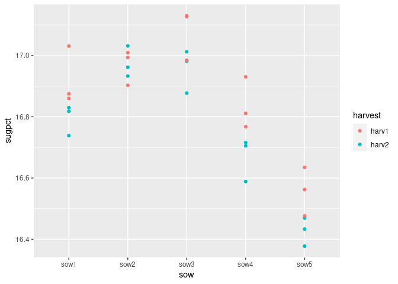

<!-- README.md is generated from README.Rmd. Please edit only README.Rmd! -->

# `pbkrtest`: Parametric Bootstrap, Kenward-Roger and Satterthwaite Based Methods for Mixed Model Comparison

Attention is on mixed effects models (as implemented in the ‘lme4’
package). For linear mixed models, ‘pbkrtest’ implements (1) a
parametric bootstrap test, (2) a Kenward-Roger-type F-test and (3) a
Satterthwaite-type F-test. The parametric bootstrap test is also
implemented for generalized linear mixed models (as implemented in
‘lme4’) and for generalized linear models. The facilities of the
package are documented in the paper by Halekoh and Højsgaard, (2012, ).

Please see ‘citation(“pbkrtest”)’ for information about citing the paper
and the package. If you use the package in your work, please do cite the
2012-paper. There are other packages that use ‘pbkrtest’ under the hood.
If you use one of those packages, please do also cite our 2012 paper.

Documents:

1.  [Halekoh and Højsgaard (2012) A Kenward-Roger Approximation and
    Parametric Bootstrap Methods for Tests in Linear Mixed Models The R
    Package
    pbkrtest](https://www.jstatsoft.org/index.php/jss/article/view/v059i09/v59i09.pdf)
2.  [Vignette: introduction to
    ‘pbkrtest’](https://cran.r-project.org/package=pbkrtest/vignettes/pbkrtest.pdf)
3.  [Webpage for the
    package](https://people.math.aau.dk/~sorenh/software/pbkrtest/index.html)

<!-- badges: start 
[](https://github.com/hojsgaard/pbkrtest/actions) 
[](https://codecov.io/gh/hojsgaard/dlmextra?branch=master)
badges: end -->

## Installation

`pbkrtest` is available on CRAN and can be installed as usual:

    install.packages('pbkrtest')

To build and install from Github with vignettes run this command from
within `R` (please install `remotes` first if not already installed):

    # install.packages('remotes')
    remotes::install_github("hojsgaard/pbkrtest", build_vignettes = TRUE)

## Development site

See <https://github.com/hojsgaard/pbkrtest>.

## Online documentation

See <https://hojsgaard.github.io/pbkrtest/>.

## Brief introduction

``` r
library(pbkrtest)
library(ggplot2)

ggplot(sleepstudy) + geom_line(aes(Days, Reaction, group=Subject, color=Subject))
```

<!-- -->

``` r

fm0 <- lmer(Reaction ~ Days + (Days|Subject), data=sleepstudy)
fm1 <- update(fm0, .~. - Days)

## Is there an effect of Days?

an <- anova(fm0, fm1)
pb <- PBmodcomp(fm0, fm1)
kr <- KRmodcomp(fm0, fm1)
#> Warning in structure(if (useGrad) which.min(diff1) else if (Meth == "qr") {:
#> rankMatrix(x, method='qr'): computing t(x) as nrow(x) < ncol(x)
sat <- SATmodcomp(fm0, fm1)

tidy(an)
#> # A tibble: 2 × 9
#>   term   npar   AIC   BIC logLik deviance statistic    df     p.value
#>   <chr> <dbl> <dbl> <dbl>  <dbl>    <dbl>     <dbl> <dbl>       <dbl>
#> 1 fm1       5 1785. 1801.  -888.    1775.      NA      NA NA         
#> 2 fm0       6 1764. 1783.  -876.    1752.      23.5     1  0.00000123
tidy(pb)
#> # A tibble: 2 × 4
#>   type    stat    df    p.value
#>   <chr>  <dbl> <dbl>      <dbl>
#> 1 LRT     23.5     1 0.00000123
#> 2 PBtest  23.5    NA 0.00100
tidy(kr)
#> # A tibble: 2 × 6
#>   type    stat   ndf   ddf F.scaling p.value
#>   <chr>  <dbl> <int> <dbl>     <dbl>   <dbl>
#> 1 Ftest   31.4     1  1.03         1   0.107
#> 2 FtestU  31.4     1  1.03        NA   0.107
tidy(sat)
#> # A tibble: 1 × 5
#>   type  statistic   ndf   ddf    p.value
#>   <chr>     <dbl> <int> <dbl>      <dbl>
#> 1 Ftest      45.9     1  17.0 0.00000326
```

Please find more examples in the other vignettes available at
<https://hojsgaard.github.io/pbkrtest/>.
