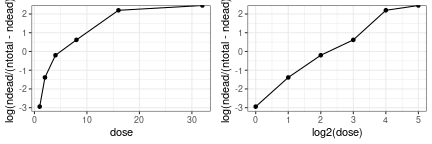

<!-- \tableofcontents -->

<!---

  - name: Mikkel Meyer Andersen
    affiliation: Department of Mathematical Sciences, Aalborg University, Denmark
    address:
    - Skjernvej 4A
    - 9220 Aalborg Ø, Denmark
    email:  mikl@math.aau.dk
  - name: Søren Højsgaard
    affiliation: Department of Mathematical Sciences, Aalborg University, Denmark
    address:
    - Skjernvej 4A
    - 9220 Aalborg Ø, Denmark
    email:  sorenh@math.aau.dk

abstract: >
  The capability of \proglang{R} to do symbolic mathematics is enhanced by the \pkg{caracas} package. 
  This package uses the \proglang{Python} computer algebra library SymPy as a back-end 
  but \pkg{caracas} is tightly integrated in the \proglang{R} environment, thereby enabling the \proglang{R} user 
  with symbolic mathematics within \proglang{R}. 
  Key components of the \pkg{caracas} package are illustrated in this paper. 
  Examples are taken from statistics and mathematics. The \pkg{caracas} package integrates well with e.g. \pkg{Rmarkdown}, and as such creation of scientific reports and teaching is supported. 

keywords:
  formatted: [differentiation, factor analysis, Hessian matrix, integration, Lagrange multiplier, limit, linear algebra, principal component analysis, score function, symbolic mathematics, Taylor expansion, teaching]
  plain:     [differentiation, factor analysis, Hessian matrix, integration, Lagrange multiplier, limit, linear algebra, principal component analysis, score function, symbolic mathematics, Taylor expansion, teaching]

  # If you use tex in the formatted title, also supply version without
  plain:     "Computer Algebra in R with caracas"
  # For running headers, if needed
  short:     "\\pkg{caracas}: Computer Algebra in \\proglang{R}"

\usepackage{boxedminipage}

  rticles::jss_article:
    latex_engine: xelatex
    fig_caption: yes
    keep_tex: true
    toc: true
    toc_depth: 4
    number_sections: true
--->


<!-- \renewenvironment{Schunk}{\begin{center} -->
<!--     \begin{boxedminipage}{0.95\textwidth}\openup-1pt}{\end{boxedminipage}\end{center}} -->
<!-- \RecustomVerbatimEnvironment{Sinput}{Verbatim} -->
<!--     {fontsize=\small,xleftmargin=5mm,formatcom=\color{black},frame=single,framerule=0.1pt,numbers=left} -->
<!-- \RecustomVerbatimEnvironment{Soutput}{Verbatim} -->
<!--     {fontsize=\scriptsize,xleftmargin=5mm,formatcom=\color{black},frame=single,framerule=0.1pt,numbers=left} -->

<!-- \newlength{\fancyvrbtopsep} -->
<!-- \newlength{\fancyvrbpartopsep} -->
<!-- \makeatletter -->
<!-- \FV@AddToHook{\FV@ListParameterHook}{\topsep=\fancyvrbtopsep\partopsep=\fancyvrbpartopsep} -->
<!-- \makeatother -->

<!-- \setlength{\fancyvrbtopsep}{0pt} -->
<!-- \setlength{\fancyvrbpartopsep}{-1pt} -->


<!---
BEFORE SUBMISSION
--->
<!-- \RecustomVerbatimEnvironment{Sinput}{Verbatim}{fontsize=\scriptsize,xleftmargin=5mm,formatcom=\color{blue},frame=single,framerule=0.1pt} -->

<!-- \RecustomVerbatimEnvironment{Soutput}{Verbatim}{fontsize=\scriptsize,xleftmargin=5mm,formatcom=\color{violet},frame=single,framerule=0.1pt} -->

<!---
\RecustomVerbatimEnvironment{Sinput}{Verbatim}{xleftmargin=3mm,formatcom=\color{black}}

\RecustomVerbatimEnvironment{Soutput}{Verbatim}{xleftmargin=4mm,formatcom=\color{black}}
--->

\def\EE{\mathbf{E}}
\def\var{\mathbf{Var}}
\def\cov{\mathbf{Cov}}
\def\trace{\mathbf{tr}}
\def\det{\mathbf{det}}
\def\diag{\mathbf{diag}}
\def\proglang#1{\texttt{#1}}
\def\pkg#1{\texttt{#1}}

\def\sympy{\texttt{SymPy}}
\def\python{\texttt{Python}}
\def\caracas{\texttt{caracas}}
\def\r{\texttt{R}}


\def\bb{{b}}

<!-- \def\citet#1{\texttt{#1}} -->
<!-- \def\citep#1{\texttt{#1}} -->

\def\inv{^{-1}}
\def\transp{^\top}
\def\cip{\perp\!\!\perp}

\newcommand{\matrxr}[1]
{\left(
    \begin{array}{rrrrrrrrrrrrrrrrrrrrrrrrrrrrrrrrrrrrr}
      #1 \\
    \end{array}
  \right)}
  
\newcommand{\matrxc}[1]
{\left(
    \begin{array}{cccccccccccccccccccccccccccccccccccc}
      #1 \\
    \end{array}
  \right)}  

\makeatletter
\renewcommand*\env@matrix[1][c]{\hskip -\arraycolsep
  \let\@ifnextchar\new@ifnextchar
  \array{*\c@MaxMatrixCols #1}}
\makeatother

\parindent0pt


<!-- Obsolete? -->


# Introduction
\label{sec:introduction}

The capability of \proglang{R} [@R] to handle symbolic mathematics is
enhanced by two add-on packages: The \pkg{caracas} package
[@caracas:21] and the \pkg{Ryacas} package [@ryacas].  In this paper
we will illustrate the use of the \pkg{caracas} package for a
particular application: teaching statistics, where symbolic
mathematics is helpful, strongly aided by the packages' ability to
enter in a reproducible framework (provided by, e.g.\ \pkg{Rmarkdown}
[@rmarkdown; @RMarkdownDefinitiveGuide; @RMarkdownCookbook]).  Focus
is on 1) treating statistical models symbolically, 2) on briding the
gap between symbolic mathematics and numerical computations and 3) on
preparing teaching material.
The \pkg{caracas} package is available from CRAN [@R]
and its open-source development available at
<https://github.com/r-cas/caracas>.  Several vignettes illustrating
\pkg{caracas} are provided and they are also available online, see
<https://r-cas.github.io/caracas/>.
The reason we chose to focus on the \pkg{caracas} package will 
be explained below. 

<!-- ## The \pkg{caracas} package versus other computer algebra systems -->

Neither \pkg{caracas} nor \pkg{Ryacas} are as powerful as some
of the large commercial computer algebra systems (CAS).  The virtue of
\pkg{caracas} and \pkg{Ryacas} lie elsewhere:
(1) Tools like solving equations, summation, limits, symbolic linear
   algebra, outputting in tex format etc. are directly available from
   within \proglang{R}.
(2) The packages enable working with the same language and in the same
   environment as the user does for statistical analyses.
(3) Symbolic mathematics can easily be combined with data which is
   helpful in e.g. numerical optimization.
(4) Lastly, the packages are freely
   available and therefore support e.g.\ education - also of people
   with limited economical means and thus contributing to United
   Nations sustainable development goals, cfr. [@UN17].

With respect to freely available resources in a CAS context, we would
like to draw attention to `WolframAlpha`, see
<https://www.wolframalpha.com/>, which provides an online service for
answering (mathematical) queries.\footnote{Need mention related
R-packages? "Related Work"-section?}

The paper is organized as follows: To make the paper self contained,
Sec. \ref{sec:primer} contains a short introduction to
`caracas`. Sec. \ref{sec:teaching} describes how `caracas` can be used
in connection with preparing teaching material. In
Sec. \ref{sec:statistics} we present a sample of statistical models
where we believe that a symbolic treatment is a valuable supplement to
a numerical in connection with teaching. In each subsection we make
suggestions about activities for students. Lastly,
Sec. \ref{sec:discussion} contains a discussion of the paper.
 

# A short primer {#sec:primer}

Readers are recommended to study the online documentation at
<https://r-cas.github.io/caracas/>. However, a very short introduction
is provided below to make this paper self contained.  The
\pkg{caracas} package provides an interface from \proglang{R} to the
\proglang{Python} package \sympy\ [@sympy]. This means that SymPy is
"running under the hood" of \proglang{R} via the \pkg{reticulate}
package [@reticulate].  The \sympy\ package is mature and robust with
many users and developers.

A symbol in \caracas\ is a list with a `pyobj` slot and the class
`caracas_symbol`.  The `pyobj` is an an object in \proglang{Python}
(often a \sympy\ object).  As such, a symbol (in \proglang{R})
provides a handle to a \proglang{Python} object.  In the design of
\pkg{caracas} we have tried to make this distinction something the
user should not be concerned with, but it is worthwhile being aware of
the distinction.

There are several ways of creating symbols. One is with `def_sym()` which
declares the symbol in \proglang{R} and in
\proglang{Python}:\footnote{Should be stringent: R objects and R
expressions on one side. Should we call them R-symbols. Is it then
SymPy objects or Python objects on the other? SymPy documentations
writes that all objects in SymPy are Python objects. }


```r
R> ## Define symbols and assign in global environment: 
R> def_sym(s1, s2) ## Note: 's1' and 's2' exist in both R and Python
R> s1
```

```
## [caracas]: s1
```

```r
R> ## Create new symbol from existing ones
R> s3 <- s1 * s2
R> s3 ## Note: 's3' is a symbol in R; no corresponding object in Python
```

```
## [caracas]: s1*s2
```

The \caracas\ object `s3` is a list with a `pyobj` slot and the class `caracas_symbol`:

```r
R> str(s3)
```

```
## List of 1
##  $ pyobj:s1*s2
##  - attr(*, "class")= chr "caracas_symbol"
```

The call `def_sym(s1, s2)` above is a short-hand for the using 
the `symbol()` function:

```r
R> s1 <- symbol("s1") # LHS s1: R object; RHS 's1': Python object
R> s2 <- symbol("s2")
```

<!-- Note \caracas\ and \sympy\ symbols need not have the same name: -->
<!-- ```{r, eval=FALSE} -->
<!-- a <- symbol("b") -->
<!-- a$pyobj -->
<!-- b <- symbol("a") -->
<!-- b$pyobj -->
<!-- ``` -->


<!-- We can further exemplify that objects in \proglang{R} and \proglang{Python} do not -->
<!-- necessarily have identical identifiers.  -->

Note \caracas\ and \sympy\ symbols need not have the same name:
We look into a symbol, and to make the
distinction clear we use different names. 


```r
R> # Create a symbol 'b1' corresponding to an entity called 'a' in SymPy:
R> b1 <- symbol("a")
R> b1
```

```
## [caracas]: a
```

```r
R> # A new symbol can be created as:
R> b2 <- b1 + 1
R> b2
```

```
## [caracas]: a + 1
```

One \caracas\ symbol can be substituted with another with (which here
has the side effect that new \caracas\ symbols `u` and `v` are
created):


```r
R> s4 <- subs(s3, c("s1", "s2"), c("u+v", "u-v"))
R> s4
```

```
## [caracas]: (u - v)*(u + v)
```

Coercion from \caracas\ symbols to \r\ expressions and vice versa is straight forward:

```r
R> as_expr(s4)
```

```
## expression((u - v) * (u + v))
```

```r
R> as_sym(as_expr(s4))
```

```
## [caracas]: (u - v)*(u + v)
```

<!-- Going back to the first example, we can substitute one symbol with -->
<!-- another and simplify the result as (where we use \proglang{R}'s native pipe operator, `|>`): -->
<!-- ```{r} -->
<!-- s4 <- s3 |> subs("s1", "u + v") |> subs("s2", "u - v"); s4 -->
<!-- s5 <- expand(s4); s5 -->
<!-- ``` -->

<!-- A caracas object can be printed in \LaTeX format: -->

<!-- ```{r} -->
<!-- tex(s5)  -->
<!-- ``` -->

<!-- It is also possible to convert to and from symbols and standard \proglang{R} expressions: -->
<!-- ```{r} -->
<!-- # Coerce from symbol to expression: -->
<!-- e5 <- as_expr(s5) -->
<!-- e5 -->
<!-- # Coerce from expression to symbol: -->
<!-- as_sym(e5) # identical to s5 -->
<!-- ``` -->


# Preparing teaching material {#sec:teaching}

Typing mathematics in lecture notes and slides can be tedious and is
hence error prone. Here `caracas` is of great help.\footnote{Reference
to R-markdown etc.}


```r
R> M <- matrix_sym(2, 2, "m")
```

<!---
https://bookdown.org/yihui/rmarkdown-cookbook/verbatim-code-chunks.html#show-a-verbatim-inline-expression
--->

Typing `` $$M = `r tex(M)`$$ ``
produces the result 
$$
M = \left[\begin{matrix}m_{11} & m_{12}\\m_{21} & m_{22}\end{matrix}\right]
$$

This can be exploited, e.g. as demonstrated in the following examples:


```r
R> Minv <- inv(M)
R> denom <- denominator(Minv[1, 1])
R> Minv_fact <- mat_factor_div(Minv, denom)
```

Typing `` $$M\inv = `r tex(Minv)`$$ `` produces

$$
M\inv = \left[\begin{matrix}\frac{m_{22}}{m_{11} m_{22} - m_{12} m_{21}} & - \frac{m_{12}}{m_{11} m_{22} - m_{12} m_{21}}\\- \frac{m_{21}}{m_{11} m_{22} - m_{12} m_{21}} & \frac{m_{11}}{m_{11} m_{22} - m_{12} m_{21}}\end{matrix}\right]
$$

whereas typing `` $$M\inv = `r tex(Minv_fact)`$$ `` produces this:

$$
M\inv = \frac{1}{m_{11} m_{22} - m_{12} m_{21}}  \left[\begin{matrix}m_{22} & - m_{12}\\- m_{21} & m_{11}\end{matrix}\right]
$$

In this situation we could also have defined `Minv_fact` using 
the expression `as_factor_list(1/denom, Minv*denom)` instead. 


# Statistics examples {#sec:statistics}


## Studying a covariance function - and some limitations of `caracas`

As mentioned in Sec.\ \ref{sec:introduction}, `caracas` is not as
powerful as some of the large commercial computer algebra systems
(CAS). One obvious restriction is that `caracas` can not operate on
general $n \times m$ matrices (although \sympy\ has support for 
symbolic matrices, the best way to implement 
this in \pkg{caracas} is not yet found). 
Instead, $n$ and $m$ must be set to
some integer number. Hence it is difficult to study the asymptotic
behaviour when a matrix dimension goes to infinity.  


### A compound symmetry covariance structure


To be specific we
consider the following example: Consider random variables $x_1,\dots, x_n$
where $\var(x_i)=v^2$ and $\cov(x_i, x_j)=v^2 r$ for $i\not = j$,
where $|r|\le1$. Suppose interest is in the average $\var(\bar x)$ where $\bar x =
\sum_i x_i / n$ when $n$ goes to infinity. One approach is as follow:
Let $1$ denote an $n$-vector of $1$'s and let $V$ be an $n \times
n$ matrix with $v^2$ on the diagonal and $v^2 r$ outside the
diagonal. That is, for $n=3$:


\begin{equation}
  \label{eq:1}
  V= v^2 R = v^2 \left[\begin{matrix}1 & r & r\\r & 1 & r\\r & r & 1\end{matrix}\right]. 
\end{equation}

Then $\var(\bar x)=\frac 1 {n^2} 1\transp V 1$. The answer lies
in studying the behaviour of this expression and `caracas` can not
handle this directly.

What can be done in `caracas` is the following: The variance of a sum $x. = \sum_i x_i$ 
is $\var(x.) = \sum_i \var(x_i) + 2 \sum_{ij:i<j} \cov(x_i,
x_j)$. For the specific model, one must by hand find that 
$$
\var(x.) = n v^2 + 2 v^2 r n (n-1) / 2 = n v^2 (1 + r (n-1)),
\quad
  \var(\bar x) = v^2 (1 + (n-1)r)/n
$$
which follows from that the sum of the upper
triangle of the covariance matrix is $v^2rn(n-1)/2$. 


```r
R> def_sym(v2, r, n)
R> var_sum <- n * v2 * ( 1 + r * (n - 1))
R> var_avg <- var_sum / n^2
R> var_avg %>% simplify()
```

```
## [caracas]: v2*(r*(n - 1) + 1)
##            ------------------
##                    n
```

Now we can study the limiting behaviour of the variance $\var(bar x)$ in different situations:


```r
R> lim_1 <- lim(var_avg, n, Inf)         ## When sample size n goes to infinity
R> lim_2 <- lim(var_avg, r, 0, dir='+')  ## When correlation r goes to zero
R> lim_3 <- lim(var_avg, r, 1, dir='-')  ## When correlation r goes to one
```

For a given correlation $r$ it is instructive to investigate how many
independent variables $k$ the $n$ correlated variables correspond to
(in the sense of the same variance of the average), because the $k$
can be seen as a measure of the amount of information in data.  Also,
one might study how $k$ behaves as function of $n$ when $n \rightarrow
\infty$. That is we must solve $v^2 (1 + (n-1)r)/n = v^2/k$ for $k$
and find $\lim_{n\rightarrow\infty} k$:


```r
R> def_sym(k)
R> k <- solve_sys(var_avg - v2 / k, k)[[1]]$k
R> #k <- solve_sys(var_avg, v2 / k, k)[[1]]$k  ## FIXME: Fails with three arguments
R> l <- lim(k, n, Inf)
```

The findings above are:
\[
\lim_1 = r v_{2}, \quad
\lim_2 = \frac{v_{2}}{n}, \quad
\lim_3 = v_{2}, \quad
k = \frac{n}{n r - r + 1}, \quad 
l = \frac{1}{r}
\]

With respect to $k$, it is illustrate to supplement the symbolic
computations above with numerical evaluations:


```r
R> dat <- expand.grid(r=c(.1, .2, .5),
+                    n=c(10, 50))
R> k. <- apply(dat, 1,
+             FUN=function(row){
+                 subs(k, c("r", "n"), row) |> as_expr()
+             })
R> dat$ri <- 1/dat$r
R> dat$k <- k.
R> dat
```

```
##     r  n ri    k
## 1 0.1 10 10 5.26
## 2 0.2 10  5 3.57
## 3 0.5 10  2 1.82
## 4 0.1 50 10 8.47
## 5 0.2 50  5 4.63
## 6 0.5 50  2 1.96
```

### Possible topics for students

It is illustrative to study such behaviours for other covariance
functions. One choice for students could be e.g.  $\cov(x_i,
x_j)=v^2 r^{|i-j|}$; another could be  $\cov(x_i,
x_j)=v^2 r$ if $|i-j| = 1$ and $\cov(x_i,
x_j)=0$ if $|i-j| > 1$. 


## Linear models 


In the following we consider linear normal models of the form $y \sim
N_n(\mu, \sigma^2 I)$ where $y=(y_1, \dots, y_n)$ is a random vector
and the mean vector $\mu$ is an element in a $q$-dimensional linear
subspace $L$ of $R^n$.  In practice, $L$ is specified as the
columnspace $C(X)$ of a (usually full rank) $n\times q$ matrix $X$, so
the mean has the form $\mu=X\bb$ where $X$ is a model matrix and $\bb$
is a vector of regression parameters. See e.g.\ [@xxx] for
details.\footnote{REFERENCE to any book on linear normal models.}

A matrix algebra approach to such models can go along the following
lines: We wish to find the vector $\hat \bb$ that minimizes $||y-X
\bb||^2$ which leads to the normal equations $(X\transp X)\bb =
X\transp y$. If $X$ has full rank, the unique solution to the normal
equations is $\hat \bb = (X^\top X)^{-1} X^\top y$. Hence the
estimated mean vector is $\hat \mu = X\hat\bb=X(X^\top X)^{-1} X^\top
y$.  Another (but closely related) approach is geometrical: $\hat \mu$
is the orthogonal projection of $y$ onto the column space $C(X)$,
and the projection matrix is given as $P=X(X^\top X)^{-1} X^\top$, so
$\hat \mu = P y = X\hat\bb=X(X^\top X)^{-1} X^\top y$ as before.  The
estimated parameter vector $\hat\bb$ is a linear function of $y$ and
is normal $\hat\bb \sim N_q(\bb, \sigma^2 (X\transp X)\inv)$.  Since
$P$ is an orhogonal projection matrix, $P$ is symmetric and idempotent
with rank $q$. Hence $Py \sim N_n(\mu, \sigma^2 P)$ follows a singular
$n$ dimensional normal distribution. Similarly, $(I-P)y \sim N(0,
\sigma^2(I-P))$. 

Such a matrix approach is very brief and concise, but the matrix
algebra also obscures what is computed. Numerical examples are useful
for some aspects of the computations but not for other. In this
respect symbolic computations can be enlightening.  We will
demonstrate such examples in the following.


### One-way analysis of variance (one-way anova) {#one-way}

Consider one-way analysis of variance (ANOVA) with 
three groups and two replicates per group.


```r
R> n_grp <- 3 # Number of groups
R> n_rpg <- 2 # Number of replicates per group
R> grp <- rep(paste0("g", seq_len(n_grp)), each = n_rpg)
R> dat <- expand.grid(grp = grp)
R> X <- as_sym(model.matrix(~ grp, data = dat))
R> y <- vector_sym(nrow(X), "y")
```

We compute the usual quantities needed for finding the least squares
estimate of the regression coefficients. 
Symbolic computations are not needed for quantities involving only the model matrix $X$, but when it comes to computations involving $y$, a symbolic
treatment of $y$ is useful:


```r
R> XtX <- t(X) %*% X
R> XtXinv <- inv(XtX)
R> Xty <- t(X) %*% y
R> b_hat <- XtXinv %*% Xty
R> y_hat <- X %*% b_hat
```

<!---
	X^\top X = \left[\begin{matrix}[r]6 & 2 & 2\\2 & 2 & .\\2 & . & 2\end{matrix}\right], \quad 
	(X^\top  X)^{-1} = \frac{1}{2}  \left[\begin{matrix}[r]1 & -1 & -1\\-1 & 2 & 1\\-1 & 1 & 2\end{matrix}\right],
--->

\[ 
	X = \left[\begin{matrix}[r]1 & . & .\\1 & . & .\\1 & 1 & .\\1 & 1 & .\\1 & . & 1\\1 & . & 1\end{matrix}\right], \quad 
  X^\top y = \left[\begin{matrix}y_{1} + y_{2} + y_{3} + y_{4} + y_{5} + y_{6}\\y_{3} + y_{4}\\y_{5} + y_{6}\end{matrix}\right],
\]
\[
	\hat{\bb} = \frac{1}{2}  \left[\begin{matrix}y_{1} + y_{2}\\- y_{1} - y_{2} + y_{3} + y_{4}\\- y_{1} - y_{2} + y_{5} + y_{6}\end{matrix}\right] ,
	\quad
	\hat{y} = \frac{1}{2}  \left[\begin{matrix}y_{1} + y_{2}\\y_{1} + y_{2}\\y_{3} + y_{4}\\y_{3} + y_{4}\\y_{5} + y_{6}\\y_{5} + y_{6}\end{matrix}\right],
\]
where dots represent zero. 


Hence $X^\top y$ consists of the sum of all observations, the sum of
observations in group 2 and the sum of observations in group 3.
Similarly, $\hat\bb$ consists of the average in group 1, the average
in group 2 minus the average in group 1 and the average in group 3
minus the average in group 1. Fitted values are simply group
averages. This can be illustrative for students to see.

The orthogonal projection matrix onto the column space 
of $X$ is:

```r
R> P <- X %*% XtXinv %*% t(X)
```

\[
P = \frac{1}{2}  \left[\begin{matrix}[r]1 & 1 & . & . & . & .\\1 & 1 & . & . & . & .\\. & . & 1 & 1 & . & .\\. & . & 1 & 1 & . & .\\. & . & . & . & 1 & 1\\. & . & . & . & 1 & 1\end{matrix}\right]
\]

### Possible topics for students

1. Related to Sec. \ref{one-way}: Verify that $(I-P)y$ are not all
	independent and that the correlation between is small and becomes
	smaller as the number of subjects per group increase. Verify that
	$P X = X$ and thus $(I - P)X = 0$. Verify also that the rank of
	$P$ equals the number of groups, which is 3. A model matrix
	also spanning $L$ is `X_2 = model.matrix(~ -1 + f)`. Investigate how
	the quantities above look for this choice of model matrix.

1. Construct a balanced two way analysis of variance (two-way anova), 
  first only with main effects and then with an interaction and compare the 
  estimates.


## Logistic regression

In the following we consider a logistic regression model: $y_i \sim
\bin(p_i, n_i)$. The probability $p_i$ is connected to a a $q$-vector
of covariates $x_i=(x_{i1}, \dots, x_{iq})$ and a $q$-vector of
regression coefficients $b=(b_1, \dots, b_q)$ as follows: Define $s_i
= x_i \cdot b$ to be the linear predictor. The probability $p_i$ is
related to $s_i$ as $\logit(p_i) = \log(p_i/(1-p_i)) = s_i$. 
See e.g.\ [@mccullagh:etal:89] for a classical description of logistic regression.

As an example, consider the `budworm` data from the `doBy`
package. The data shows the number of killed moth tobacco budworm
\emph{Heliothis virescens} for each of 6 doses of the pyrethroid
trans-cypermethrin differentiated with respect to sex.


```r
R> budworm <- doBy::budworm
R> bud <- subset(budworm, sex == "male")
R> bud
```

```
##    sex dose ndead ntotal
## 1 male    1     1     20
## 2 male    2     4     20
## 3 male    4     9     20
## 4 male    8    13     20
## 5 male   16    18     20
## 6 male   32    20     20
```

Below we focus only on male budworms and the mortality is illustrated in Fig. \ref{fig:budworm}. 
On the $y$-axis we have the empirical logits $\log(\text{ndead}/(\text{ntotal}-\text{ndead}))$.\footnote{FIXME: These are not quite empirical logits; need nicer y-axis.}




### Each component of likelihood {#sec:logistic-each-component}

The log-likelihood is $\log L=\sum_i y_i \log(p_i) + (n_i-y_i) \log(1-p_i) =
\sum_i \log L_i$, say. With $\log(p_i/(1-p_i)) = s_i$ we have $p_i=1 / (1+
\exp(-s_i))$ and $\frac d {ds_i} p_i = \frac{\exp(- s_i)}{\left(1 +
\exp(- s_i)\right)^{2}}$. With $s_i = x_i\cdot b$, we have $\frac d {db}
s_i = x_i$.

Consider the contribution to the total log-likelihood from the $i$th
observation which is $l_i = y_i \log(p_i) + (n_i-y_i) \log(1-p_i)$. 
Since we are focusing on one observation only, we shall ignore the subscript $i$ 
in this section. The log-likelihood and its derivative is:


```r
R> def_sym(y, n, p, x, s, b)
R> logL_ <- y * log(p) + (n - y) * log(1 - p)
R> der(logL_, p)
```

```
## [caracas]:   n - y   y
##            - ----- + -
##              1 - p   p
```

The underscore in `logL_` indicates that this expression 
is defined in terms of other symbols. This is in contrast 
to the free variables, e.g.\ `y`, `p`, and `n`.
With $s = \log(p/(1-p))$ we can find $p$ as:

```r
R> sol_ <- solve_sys(log(p / (1 - p)), s, p)
R> p_ <- sol_[[1]]$p
R> p_
```

```
## [caracas]:   exp(s)  
##            ----------
##            exp(s) + 1
```

Again, notice that `p_` depends on the free symbol `s`, 
hence the underscore (`_`) in its name.
The log-likelihood and its derivative as
functions of $s$ become:


```r
R> logL2_ <- subs(logL_, p, p_)
R> logL2_
```

```
## [caracas]:      /  exp(s)  \              /      exp(s)  \
##            y*log|----------| + (n - y)*log|1 - ----------|
##                 \exp(s) + 1/              \    exp(s) + 1/
```

```r
R> der(logL2_, s) |> simplify()
```

```
## [caracas]: -n*exp(s) + y*exp(s) + y
##            ------------------------
##                   exp(s) + 1
```

Lastly we connect $s$ to the regression coefficients and 
compute the score function, $S$, and the Hessian, $H$:


```r
R> s_ <- sum(x * b)
R> logL3_ <- subs(logL2_, s, s_)
```


```r
R> S_ <- score(logL3_, b) |> simplify()
R> H_ <- hessian(logL3_, b) |> simplify()
R> S_
```

```
## [caracas]: [x*(y - (n - y)*exp(b*x))]
##            [------------------------]
##            [      exp(b*x) + 1      ]
```

```r
R> H_
```

```
## [caracas]: [          2                ]
##            [      -n*x *exp(b*x)       ]
##            [---------------------------]
##            [exp(2*b*x) + 2*exp(b*x) + 1]
```


```r
R> def_sym(a,b)
R> a <- b + b^2
R> subs(a, b, 2) ## FAILS
```

```
## [caracas]: 6
```

```r
R> subs(a, "b", 2) ## WORKS
```

```
## [caracas]: 6
```

```r
R> subs(a, cbind(b), 2) ## WORKS
```

```
## [caracas]: 6
```

Since $x$ and $\bb$ are vectors the term `x*b` above should be
 read as the inner product $x \cdot \bb$ (or as $x\transp \bb$
 in matrix notation). Also, since $x$ is a vector, the term `x^2`
 above should be read as the outer product $x \otimes x$ (or as
 $x x\transp$ in matrix notation). 

More insight in the structure is obtained by letting $b$ and $x$ be $2$-vectors:

```r
R> b <- vector_sym(2, "b")
R> x <- vector_sym(2, "x")
R> s_ <- sum(x * b)
R> logL3_ <- subs(logL2_, s, s_)
```

Again, we compute the score function, $S$, and Hessian, $H$:


```r
R> S_ <- score(logL3_, b) |> simplify()
R> H_ <- hessian(logL3_, b) |> simplify()
```

\begin{align}
S &= \left[\begin{matrix}[r]\frac{x_{1} \left(- n e^{b_{1} x_{1} + b_{2} x_{2}} + y e^{b_{1} x_{1} + b_{2} x_{2}} + y\right)}{e^{b_{1} x_{1} + b_{2} x_{2}} + 1}\\\frac{x_{2} \left(- n e^{b_{1} x_{1} + b_{2} x_{2}} + y e^{b_{1} x_{1} + b_{2} x_{2}} + y\right)}{e^{b_{1} x_{1} + b_{2} x_{2}} + 1}\end{matrix}\right], \\
H &= \left[\begin{matrix}[r]- \frac{n x_{1}^{2} e^{b_{1} x_{1} + b_{2} x_{2}}}{2 e^{b_{1} x_{1} + b_{2} x_{2}} + e^{2 b_{1} x_{1} + 2 b_{2} x_{2}} + 1} & - \frac{n x_{1} x_{2} e^{b_{1} x_{1} + b_{2} x_{2}}}{2 e^{b_{1} x_{1} + b_{2} x_{2}} + e^{2 b_{1} x_{1} + 2 b_{2} x_{2}} + 1}\\- \frac{n x_{1} x_{2} e^{b_{1} x_{1} + b_{2} x_{2}}}{2 e^{b_{1} x_{1} + b_{2} x_{2}} + e^{2 b_{1} x_{1} + 2 b_{2} x_{2}} + 1} & - \frac{n x_{2}^{2} e^{b_{1} x_{1} + b_{2} x_{2}}}{2 e^{b_{1} x_{1} + b_{2} x_{2}} + e^{2 b_{1} x_{1} + 2 b_{2} x_{2}} + 1}\end{matrix}\right]
\end{align}


Next, insert data, h e.g.\ $x_{1}=1$, $x_{2}=2$, $y=9$, $n=20$ as

```r
R> S. <- subs(S_, c("x1", "x2", "y", "n"), c(1, 2, 9, 20))
R> H. <- subs(H_, c("x1", "x2", "y", "n"), c(1, 2, 9, 20))
```

Note, how the expression depending on other symbols, `S_`, is 
named `S.` to indiciate that data has been inserted.

\begin{align}
S &= \left[\begin{matrix}[r]\frac{9 - 11 e^{b_{1} + 2 b_{2}}}{e^{b_{1} + 2 b_{2}} + 1}\\\frac{2 \left(9 - 11 e^{b_{1} + 2 b_{2}}\right)}{e^{b_{1} + 2 b_{2}} + 1}\end{matrix}\right], \\
H &= \left[\begin{matrix}[r]- \frac{20 e^{b_{1} + 2 b_{2}}}{2 e^{b_{1} + 2 b_{2}} + e^{2 b_{1} + 4 b_{2}} + 1} & - \frac{40 e^{b_{1} + 2 b_{2}}}{2 e^{b_{1} + 2 b_{2}} + e^{2 b_{1} + 4 b_{2}} + 1}\\- \frac{40 e^{b_{1} + 2 b_{2}}}{2 e^{b_{1} + 2 b_{2}} + e^{2 b_{1} + 4 b_{2}} + 1} & - \frac{80 e^{b_{1} + 2 b_{2}}}{2 e^{b_{1} + 2 b_{2}} + e^{2 b_{1} + 4 b_{2}} + 1}\end{matrix}\right]
\end{align}

Notice that $S$ and $H$ depend only on the unknown regression
coefficients. 
The score and Hessian for a full data set is the sum of
such terms and it is a straight forward \proglang{R} task to construct these
sums. 


### Bridging the gap - Preparing for numerical evaluation

We prepare the full score function, $S$, and Hessian, $H$, for 
all observations:


```r
R> S.list <- lapply(seq_len(nrow(bud)), function(r){
+     subs(S_, c("x1", "x2", "y", "n"), 
+          c(1, log2(bud$dose[r]), bud$ndead[r], bud$ntotal[r]))
+ })
R> S. <- Reduce(`+`, S.list)
R> 
R> H.list <- lapply(seq_len(nrow(bud)), function(r){
+     subs(H_, c("x1", "x2", "y", "n"), 
+          c(1, log2(bud$dose[r]), bud$ndead[r], bud$ntotal[r]))
+ })
R> H. <- Reduce(`+`, H.list)
```

These quantities can be used in a numerical optimisation, 
see Sec. \ref{sec:students-logit}.

<!---
```{r
newton_rapson <- function(b., S., H.){
    it <- 0
    repeat{
        S_i <- as_expr(subs(S., b, b.))
        H_i <- as_expr(subs(H., b, b.))  
        b2. <- b. - solve(H_i, S_i)
        if (max(abs(b2. - b.)) < 1e-4) break
        b. <- b2.
        it <- it + 1
    }
    list(b=as.numeric(b.), Vb=-solve(H_i), H=H_i, it=it)
}
```


```{r
nr <- newton_rapson(c(-3, 1), S., H.)
nr$b
nr$Vb
```

```{r
mm <- glm(cbind(ndead, ntotal - ndead) ~ log2(dose), data = bud, family = binomial())
summary(mm) %>% coef()
vcov(mm)
```
--->


### All of the likelihood {#sec:logistic-all-likelihood}

An alternative to the approach above is to specify the full likelihood directly:


```r
R> N <- 6 ## Number of rows in dataset
R> q <- 2 ## Number of explanatory variables
R> X <- matrix_sym(N, q, "x")
R> y <- vector_sym(N, "y")
R> n <- vector_sym(N, "n")
R> p <- vector_sym(N, "p")
R> s <- vector_sym(N, "s")
R> b <- vector_sym(q, "b")
```

$$
 X=\left[\begin{matrix}[r]x_{11} & x_{12}\\x_{21} & x_{22}\\x_{31} & x_{32}\\x_{41} & x_{42}\\x_{51} & x_{52}\\x_{61} & x_{62}\end{matrix}\right], \quad
 n=\left[\begin{matrix}[r]n_{1}\\n_{2}\\n_{3}\\n_{4}\\n_{5}\\n_{6}\end{matrix}\right], \quad
 y=\left[\begin{matrix}[r]y_{1}\\y_{2}\\y_{3}\\y_{4}\\y_{5}\\y_{6}\end{matrix}\right]
$$


The symbolic computations are as follows:


```r
R> ## log-Likelihood:
R> logL_  <- sum(y * log(p) + (n-y) * log(1-p))
R> ## connecting p and s:
R> p_ <- 1 / (1 + exp(-s))
R> ## log-likelihood as function of linear predictor:
R> logL2_ <- subs(logL_, p, p_)
R> ## linear predictor as function of regression coefficients:
R> s_  <- X %*% b
R> ## log-Likelihood as function of regression coefficients:
R> logL3_ <- subs(logL2_, s, s_)
R> ## Score and Hessian:
R> S_ <- score(logL3_, b) 
R> H_ <- hessian(logL3_, b)
```


<!---
### Numerical evaluation

Substitute data into score and Hessian:

```{r
X. <- cbind(1, log2(bud$dose))
S. <- subs(S_, cbind(n, y, X), cbind(bud$ntotal, bud$ndead, X.))
H. <- subs(H_, cbind(n, y, X), cbind(bud$ntotal, bud$ndead, X.))
```

```{r
nr <- newton_rapson(c(-3, 1), S., H.)
nr$b
-solve(nr$H)
```
--->

### Possible topics for students {#sec:students-logit}


1. Related to Sec. \ref{sec:logistic-each-component}: Implement
   Newton-Rapson to solve the likelihood equations and compare your
   solution to the output from `glm()`.

1. Related to Sec. \ref{sec:logistic-all-likelihood}: Used the above
   symbolic computations and substitute data in directly. 
   Compare to `S.` and `H.` from Sec. \ref{sec:logistic-each-component}.

## Maximum likelihood under constraints

In this section we illustrate constrained optimization using Lagrange multipliers, see e.g. [@xxx] for details.\footnote{REFERENCE is needed} 

### Independence model for $2\times 2$ contingency table


Consider a $2 \times 2$ contingency table with cell 
counts $n_{ij}$ and cell probabilities $p_{ij}$ for $i=1,2$ and $j=1,2$. 

```r
R> tt
```

```
##    c
## r   1   2  
##   1 n11 n12
##   2 n21 n22
```

The log likelihood is
$$
 l = \log L = \sum_{ij} n_{ij} \log(p_{ij}).
$$

Under the assumption of independence between rows and columns, the cell
probabilities have the form\footnote{REFERENCE to log-linear models} 
$$
p_{ij}=u r_i s_j.
$$ 

To make the parameters $u$, $r_i$ and $s_j$ identifiable, constraints
must be imposed. One possibility is then to require that $r_1=s_1=1$. The
task is to estimate $u$, $r_2$, $s_2$ by maximizing the log likelihood
under the constraint that $\sum_{ij} p_{ij} = 1$.  This can be
achieved using Lagrange multiplier where we instead solve the
unconstrained optimization problem $\max_p L(p)$ where
\begin{align}
  L(p) &= -l(p) + a g(p) \quad \text{under the constraint that} \\
  g(p) &= \sum_{ij} p_{ij} - 1 = 0.
\end{align}
where $a$ is a Lagrange multiplier.


```r
R> n_ <- c("n11", "n21", "n12", "n22")
R> n  <- as_sym(n_)
R> def_sym(a, u, r2, s2)
R> p <- as_sym(c("u", "u*r2", "u*s2", "u*r2*s2"))
R> logL  <- sum(n * log(p))
R> L  <- -logL + a * (sum(p) - 1) 
R> vars <- list(u, r2, s2, a)
R> gL <- der(L, vars)
R> sol <- solve_sys(to_vector(gL), vars)
R> sol
```

```
## Solution 1:
##   u  =  (n11 + n12)*(n11 + n21) 
##        ------------------------
##                               2
##        (n11 + n12 + n21 + n22) 
##   r2 =  n21 + n22
##        ---------
##        n11 + n12 
##   s2 =  n12 + n22
##        ---------
##        n11 + n21 
##   a  =  n11 + n12 + n21 + n22
```

```r
R> sol <- sol[[1]]
```

There is only one critical point. Fitted cell probabilities $\hat p_{ij}$ are:

```r
R> p11 <- sol$u
R> p21 <- sol$u * sol$r2
R> p12 <- sol$u * sol$s2
R> p22 <- sol$u * sol$r2 * sol$s2
R> p.hat <- cbind(rbind(p11, p21), rbind(p12, p22))
```

\[
\hat p = \frac{1}{\left(n_{11} + n_{12} + n_{21} + n_{22}\right)^{2}}  \left[\begin{matrix}\left(n_{11} + n_{12}\right) \left(n_{11} + n_{21}\right) & \left(n_{11} + n_{12}\right) \left(n_{12} + n_{22}\right)\\\left(n_{11} + n_{21}\right) \left(n_{21} + n_{22}\right) & \left(n_{12} + n_{22}\right) \left(n_{21} + n_{22}\right)\end{matrix}\right]
\]

To verify that the maximum likelihood estimate has been found, we compute the Hessian matrix which is negative definite (the Hessian matrix is diagonal so the eigenvalues are the diagonal entries and these are all negative):


```r
R> H <- hessian(logL, list(u, r2, s2)) |> simplify()
```

\[
  H = \left[\begin{matrix}[r]- \frac{n_{11} + n_{12} + n_{21} + n_{22}}{u^{2}} & . & .\\. & - \frac{n_{21} + n_{22}}{r_{2}^{2}} & .\\. & . & - \frac{n_{12} + n_{22}}{s_{2}^{2}}\end{matrix}\right], \quad
\]


### Possible topics for students 

1. A simple task is to consider a multinomial distribution with three categories, counts $y_i$ and cell probabilities $p_i$, $i=1,2,3$ where $\sum_i p_i=1$. For this model, find the maximum likelihood estimate for $p_i$. 

1. Above, identifiability of the parameters was handled by not including $r_1$ and $s_1$ in the specification of $p_{ij}$. An alternative is to impose the restrictions $r_1=1$ and $s_1=1$, and this can also be handled via Lagrange multipliers.


## Auto regressive and dynamic linear models

### Autoregressive model ($AR(1)$) {#sec:ar1}


Consider the auto regressive model of order $1$ (an AR(1) model), see e.g. [@xxx] for details:\footnote{REFERENCE is needed} 
$$
x_i = a x_{i-1} + e_i, \quad i=1, \dots, 3; \quad x_0 = e_0,
$$ 
where all terms $e_0, \dots, e_3$ are independent and $N(0,v^2)$ distributed. Let $e=(e_0, \dots, e_3)$ and $x=(x_0, \dots x_3)$. Hence $e \sim N(0, v^2 I)$.
Isolating error terms gives
$$
e= \left[\begin{matrix}e_{0}\\e_{1}\\e_{2}\\e_{3}\end{matrix}\right] = \left[\begin{matrix}[r]1 & . & . & .\\- a & 1 & . & .\\. & - a & 1 & .\\. & . & - a & 1\end{matrix}\right] \left[\begin{matrix}x_{0}\\x_{1}\\x_{2}\\x_{3}\end{matrix}\right] = L_1 x
$$
Since $\mathbf{Var}(e)=v^2 I$ we have $\mathbf{Var}(e)=v^2 I=L
\mathbf{Var}(x) L'$ so the covariance matrix of $x$ is
$V_1=\mathbf{Var}(x) = v^2 L^- (L^-)\transp$ while the concentration matrix
(the inverse covariances matrix) is $K=v^{-2}L\transp L$.


```r
R> L1 <- diff_mat(4, "-a")
R> def_sym(v2)
R> L1inv <- inv(L1)
R> K1 <- crossprod_(L1) / v2
R> V1 <- tcrossprod_(L1inv) * v2
```

\begin{align} 
    L_1\inv &= \left[\begin{matrix}[r]1 & . & . & .\\a & 1 & . & .\\a^{2} & a & 1 & .\\a^{3} & a^{2} & a & 1\end{matrix}\right] \\ 
    K_1 &= \frac{1}{v_{2}}  \left[\begin{matrix}[r]a^{2} + 1 & - a & . & .\\- a & a^{2} + 1 & - a & .\\. & - a & a^{2} + 1 & - a\\. & . & - a & 1\end{matrix}\right] \\ 
    V_1 &= v_{2}  \left[\begin{matrix}[r]1 & a & a^{2} & a^{3}\\a & a^{2} + 1 & a^{3} + a & a^{4} + a^{2}\\a^{2} & a^{3} + a & a^{4} + a^{2} + 1 & a^{5} + a^{3} + a\\a^{3} & a^{4} + a^{2} & a^{5} + a^{3} + a & a^{6} + a^{4} + a^{2} + 1\end{matrix}\right] 
  \end{align}

The zeros in the concentration matrix $K_1$ implies a conditional
independence restrstriction: If the $ij$th element of a concentration
matrix is zero then $x_i$ and $x_j$ are conditionally independent
given all other variables, see e.g. [@xxx] for details.\footnote{REFERENCE needed. GMwR?}

Next, we take the step from symbolic computations to numerical
evaluations.  The joint distribution of $x$ is multivariate normal
distribution, $x\sim N(0, K_1\inv)$. Let $S=x x\transp$ denote the
matrix of (cross) products.  The log-likelihood is therefore (ignoring
multiplicative constants) 
$$ 
\log L = \log \det(K) - x\transp K x = \log \det(K) - \trace(K S), 
$$ 
where we note that $\trace(KS)$ is the
sum of the elementwise products of $K$ and $S$ since both matrices are
symmetrical.


```r
R> logL <- log(det(K1)) - sum(K1 * (x %*% t(x))) %>% simplify()
```

$$
\log L = \log{\left(\frac{1}{v_{2}^{4}} \right)} - \frac{- 2 a x_{0} x_{1} - 2 a x_{1} x_{2} - 2 a x_{2} x_{3} + x_{0}^{2} \left(a^{2} + 1\right) + x_{1}^{2} \left(a^{2} + 1\right) + x_{2}^{2} \left(a^{2} + 1\right) + x_{3}^{2}}{v_{2}}
$$


### Bridging the gap - Numerical evaluation 

Next we illustrate how bridge the gap  from symbolic computations to numerical computations based on a dataset:
For a specific data vector we get


```r
R> xt <- c(0.1, -0.9, 0.4, .0)
R> logL2 <- subs(logL, x, xt) 
```

$$
\log L_2 = \log{\left(\frac{1}{v_{2}^{4}} \right)} - \frac{0.98 a^{2} + 0.9 a + 0.98}{v_{2}}
$$

The score function is computed and the score equation is solved with:

```r
R> parm <- list(a, v2)
R> S <- der(logL2, parm) |> simplify()
R> sol <- solve_sys(S, parm)
R> sol
```

```
## Solution 1:
##   a  =  -0.459183673469388 
##   v2 =  0.193341836734694
```

Alternatively, one can use \r\ for the numerical optimization. 

```r
R> g <- doBy::expr_to_fun(as_expr(logL2))
R> g_wrap <- function(par){
+     g(exp(par[1]), par[2])
+ }
R> par <- optim(c(0, 1), g_wrap, control=list(fnscale=-1))$par
R> par
```

```
## [1] -1.643 -0.459
```

```r
R> par[1] <- exp(par[1])
R> names(par) <- names(formals(g))
R> par
```

```
##     v2      a 
##  0.193 -0.459
```


### Dynamic linear model {#sec:dlm}


An extension of the $AR(1)$ process above is a dynamic linear model (dlm), see e.g. [@petris:etal:09]:
Augment the $AR(1)$ process above with $y_i=b x_i + u_i$ for
$i=1,2,3$.  Suppose $u_i\sim N(0, w^2)$ and all $u_i$ are independent
and independent of $e$.
Then
$(e,u)$ can be expressed in terms of $(x,y)$ as
$$
(e,u) = \left[\begin{matrix}e_{0}\\e_{1}\\e_{2}\\e_{3}\\u_{1}\\u_{2}\\u_{3}\end{matrix}\right] = \left[\begin{matrix}[r]1 & . & . & . & . & . & .\\- a & 1 & . & . & . & . & .\\. & - a & 1 & . & . & . & .\\. & . & - a & 1 & . & . & .\\- b & 1 & . & . & 1 & . & .\\. & - b & 1 & . & . & 1 & .\\. & . & - b & 1 & . & . & 1\end{matrix}\right] \left[\begin{matrix}x_{0}\\x_{1}\\x_{2}\\x_{3}\\y_{1}\\y_{2}\\y_{3}\end{matrix}\right] = L_2 (x,y)
$$


```r
R> Veu <- diag_(c(rep("v2", 4), rep("w2", 3)))
R> L2inv <- inv(L2) 
R> V2 <- L2inv %*% Veu %*% t(L2inv) 
R> K2 <- t(L2) %*% inv(Veu) %*% L2
```

$$
 K_2 = \left[\begin{matrix}[r]\frac{a^{2}}{v_{2}} + \frac{b^{2}}{w_{2}} + \frac{1}{v_{2}} & - \frac{a}{v_{2}} - \frac{b}{w_{2}} & . & . & - \frac{b}{w_{2}} & . & .\\- \frac{a}{v_{2}} - \frac{b}{w_{2}} & \frac{a^{2}}{v_{2}} + \frac{b^{2}}{w_{2}} + \frac{1}{w_{2}} + \frac{1}{v_{2}} & - \frac{a}{v_{2}} - \frac{b}{w_{2}} & . & \frac{1}{w_{2}} & - \frac{b}{w_{2}} & .\\. & - \frac{a}{v_{2}} - \frac{b}{w_{2}} & \frac{a^{2}}{v_{2}} + \frac{b^{2}}{w_{2}} + \frac{1}{w_{2}} + \frac{1}{v_{2}} & - \frac{a}{v_{2}} - \frac{b}{w_{2}} & . & \frac{1}{w_{2}} & - \frac{b}{w_{2}}\\. & . & - \frac{a}{v_{2}} - \frac{b}{w_{2}} & \frac{1}{w_{2}} + \frac{1}{v_{2}} & . & . & \frac{1}{w_{2}}\\- \frac{b}{w_{2}} & \frac{1}{w_{2}} & . & . & \frac{1}{w_{2}} & . & .\\. & - \frac{b}{w_{2}} & \frac{1}{w_{2}} & . & . & \frac{1}{w_{2}} & .\\. & . & - \frac{b}{w_{2}} & \frac{1}{w_{2}} & . & . & \frac{1}{w_{2}}\end{matrix}\right]
$$

Notice the pattern of zeros which correspond to conditional
independence restrictions as mentioned above.


```r
R> i1 <- 1:4
R> i2 <- 5:7
R> K22 <- K2[i2, i2] %>% simplify()
R> K21 <- K2[i2, i1] %>% simplify()
R> K11 <- K2[i1, i1] %>% simplify()
```

### Possible topics for students 

1. Related to Sec. \ref{sec:ar1}: An alternative to solving the
   likelihood equations using \pkg{caracas} is to convert the \sympy
   expression for $\log L$ into an R expression and then use one of Rs
   built-in optimizer functions.\footnote{Det har jeg vist gjort}
   Modify the model by setting $x_0 = a x_3 + e_0$. Do the same for a
   longer time series and see what happens to the pattern of zeros in
   the concentration matrix.

1. Related to Sec. \ref{sec:dlm}: Find covariance / concentration for
   observables, i.e. for $(y_1, y_2, y_3)$. Use this for maximizing the
   likelihood. How feasible is this approach for a longer data vector?
   

# Discussion {#sec:discussion}

We have presented the \pkg{caracas} package and argued that the
package extends the functionality of \proglang{R} significantly with respect to
symbolic mathematics.  One practical virtue of \pkg{caracas} is
that the package integrates nicely with \pkg{Rmarkdown},
@rmarkdown, (e.g. with the `tex()` functionality) and thus
supports creating of scientific documents and teaching material. As
for the usability in practice we await feedback from users.

# Acknowledgements

We would like to thank the R Consortium for financial support for
creating the \pkg{caracas} package, users for pin pointing points
that can be improved in \pkg{caracas} and Ege Rubak (Aalborg
University, Denmark) and Malte Bødkergaard Nielsen (Aalborg
University, Denmark) for comments on this manuscript.


\tableofcontents


