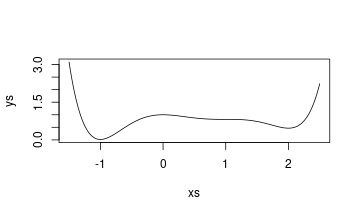
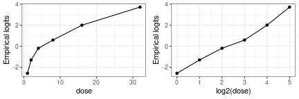

<!-- \tableofcontents -->

<!---

  - name: Mikkel Meyer Andersen
    affiliation: Department of Mathematical Sciences, Aalborg University, Denmark
    address:
    - Skjernvej 4A
    - 9220 Aalborg Ø, Denmark
    email:  mikl@math.aau.dk
  - name: Søren Højsgaard
    affiliation: Department of Mathematical Sciences, Aalborg University, Denmark
    address:
    - Skjernvej 4A
    - 9220 Aalborg Ø, Denmark
    email:  sorenh@math.aau.dk

abstract: >
  The capability of \proglang{R} to do symbolic mathematics is enhanced by the \pkg{caracas} package. 
  This package uses the \proglang{Python} computer algebra library SymPy as a back-end 
  but \pkg{caracas} is tightly integrated in the \proglang{R} environment, thereby enabling the \proglang{R} user 
  with symbolic mathematics within \proglang{R}. 
  Key components of the \pkg{caracas} package are illustrated in this paper. 
  Examples are taken from statistics and mathematics. The \pkg{caracas} package integrates well with e.g. \pkg{Rmarkdown}, and as such creation of scientific reports and teaching is supported. 

keywords:
  formatted: [differentiation, factor analysis, Hessian matrix, integration, Lagrange multiplier, limit, linear algebra, principal component analysis, score function, symbolic mathematics, Taylor expansion, teaching]
  plain:     [differentiation, factor analysis, Hessian matrix, integration, Lagrange multiplier, limit, linear algebra, principal component analysis, score function, symbolic mathematics, Taylor expansion, teaching]

  # If you use tex in the formatted title, also supply version without
  plain:     "Computer Algebra in R with caracas"
  # For running headers, if needed
  short:     "\\pkg{caracas}: Computer Algebra in \\proglang{R}"

\usepackage{boxedminipage}

  rticles::jss_article:
    latex_engine: xelatex
    fig_caption: yes
    keep_tex: true
    toc: true
    toc_depth: 4
    number_sections: true
--->


<!-- \renewenvironment{Schunk}{\begin{center} -->
<!--     \begin{boxedminipage}{0.95\textwidth}\openup-1pt}{\end{boxedminipage}\end{center}} -->
<!-- \RecustomVerbatimEnvironment{Sinput}{Verbatim} -->
<!--     {fontsize=\small,xleftmargin=5mm,formatcom=\color{black},frame=single,framerule=0.1pt,numbers=left} -->
<!-- \RecustomVerbatimEnvironment{Soutput}{Verbatim} -->
<!--     {fontsize=\scriptsize,xleftmargin=5mm,formatcom=\color{black},frame=single,framerule=0.1pt,numbers=left} -->

<!-- \newlength{\fancyvrbtopsep} -->
<!-- \newlength{\fancyvrbpartopsep} -->
<!-- \makeatletter -->
<!-- \FV@AddToHook{\FV@ListParameterHook}{\topsep=\fancyvrbtopsep\partopsep=\fancyvrbpartopsep} -->
<!-- \makeatother -->

<!-- \setlength{\fancyvrbtopsep}{0pt} -->
<!-- \setlength{\fancyvrbpartopsep}{-1pt} -->


<!---
BEFORE SUBMISSION
--->
<!-- \RecustomVerbatimEnvironment{Sinput}{Verbatim}{fontsize=\scriptsize,xleftmargin=5mm,formatcom=\color{blue},frame=single,framerule=0.1pt} -->

<!-- \RecustomVerbatimEnvironment{Soutput}{Verbatim}{fontsize=\scriptsize,xleftmargin=5mm,formatcom=\color{violet},frame=single,framerule=0.1pt} -->

<!---
\RecustomVerbatimEnvironment{Sinput}{Verbatim}{xleftmargin=3mm,formatcom=\color{black}}

\RecustomVerbatimEnvironment{Soutput}{Verbatim}{xleftmargin=4mm,formatcom=\color{black}}
--->

\def\EE{\mathbf{E}}
\def\var{\mathbf{Var}}
\def\cov{\mathbf{Cov}}
\def\trace{\mathbf{tr}}
\def\det{\mathbf{det}}
\def\diag{\mathbf{diag}}
\def\proglang#1{\texttt{#1}}
\def\pkg#1{\texttt{#1}}

\def\sympy{\texttt{SymPy}}
\def\python{\texttt{Python}}
\def\caracas{\texttt{caracas}}
\def\r{\texttt{R}}


\def\bb{{b}}

<!-- \def\citet#1{\texttt{#1}} -->
<!-- \def\citep#1{\texttt{#1}} -->

\def\inv{^{-1}}
\def\transp{^\top}
\def\cip{\perp\!\!\perp}

\newcommand{\matrxr}[1]
{\left(
    \begin{array}{rrrrrrrrrrrrrrrrrrrrrrrrrrrrrrrrrrrrr}
      #1 \\
    \end{array}
  \right)}
  
\newcommand{\matrxc}[1]
{\left(
    \begin{array}{cccccccccccccccccccccccccccccccccccc}
      #1 \\
    \end{array}
  \right)}  

\makeatletter
\renewcommand*\env@matrix[1][c]{\hskip -\arraycolsep
  \let\@ifnextchar\new@ifnextchar
  \array{*\c@MaxMatrixCols #1}}
\makeatother

\parindent0pt


<!-- Obsolete? -->


# Introduction
\label{sec:introduction}

The capability of \proglang{R} [@R] to handle symbolic mathematics is
enhanced by two add-on packages: The \pkg{caracas} package
[@caracas:21] and the \pkg{Ryacas} package [@ryacas].  In this paper
we will illustrate the use of the \pkg{caracas} package in connection with 
teaching statistics, where symbolic
mathematics is helpful, strongly aided by the packages' ability to
enter in a reproducible framework (provided by, e.g.\ \pkg{Rmarkdown}
[@rmarkdown; @RMarkdownDefinitiveGuide; @RMarkdownCookbook]).  Focus
is on 1) treating statistical models symbolically, 2) on briding the
gap between symbolic mathematics and numerical computations and 3) on
preparing teaching material.
The \pkg{caracas} package is available from CRAN [@R]
and its open-source development available at
<https://github.com/r-cas/caracas>.  Several vignettes illustrating
\pkg{caracas} are provided and they are also available online, see
<https://r-cas.github.io/caracas/>.

<!-- The reason we chose to focus on the \pkg{caracas} package will  -->
<!-- be explained below.  -->

<!-- ## The \pkg{caracas} package versus other computer algebra systems -->

Neither \pkg{caracas} nor \pkg{Ryacas} are as powerful as some
of the larger commercial computer algebra systems (CAS).  The virtue of
\pkg{caracas} and \pkg{Ryacas} lie elsewhere:
(1) Mathematical tools like equation solving, summation, limits, symbolic linear
   algebra, outputting in tex format etc.\ are directly available from
   within \proglang{R}.
(2) The packages enable working with the same language and in the same
   environment as the user does for statistical analyses.
(3) Symbolic mathematics can easily be combined with data which is
   helpful in e.g. numerical optimization.
(4) Lastly, the packages are freely
   available and therefore support e.g.\ education - also of people
   with limited economical means and thus contributing to United
   Nations sustainable development goals, cfr. [@UN17].

The paper is organized as follows: Sec. \ref{sec:primer} contains a
short introduction to `caracas`. 
Sec. \ref{sec:teaching} describes how
`caracas` can be used in connection with preparing texts, e.g.\ teaching
material. 
Sec. \ref{sec:statistics} is the main section of the
paper and here we present a sample of statistical models where we
believe that a symbolic treatment is a valuable supplement to a
numerical in connection with teaching. In each subsection we make
suggestions about activities for students. 
Lastly,
Sec. \ref{sec:discussion} contains a discussion of the paper.


<!-- Verifying and helping with math derivations and computations -->

<!-- Statistics, calculus and linear algebra -->

<!-- Gradients; Hessians; Newton-rapson. -->

<!-- Gradient descent; compute gradient as alternative to finite difference approach. -->


# Mathematics with caracas - and a short primer {#sec:primer}

There are two purposes of this section: Showing how to solve a
relatively simple mathematical problem and provide a brief
introduction to \caracas .  Readers are recommended to study the online
documentation at <https://r-cas.github.io/caracas/>.  The \caracas
package provides an interface from \proglang{R} to the
\proglang{Python} package \sympy\ [@sympy]. This means that SymPy is
"running under the hood" of \proglang{R} via the \pkg{reticulate}
package [@reticulate].  The \sympy\ package is mature and robust with
many users and developers.

A  \caracas\ symbol is a list with a `pyobj` slot and the class
`caracas_symbol`.  The `pyobj` is an an object in \proglang{Python}
(often a \sympy\ object).  As such, a symbol (in \proglang{R})
provides a handle to a \proglang{Python} object.  In the design of
\pkg{caracas} we have tried to make this distinction something the
user should not be concerned with, but it is worthwhile being aware of
the distinction.

There are several ways of creating symbols. One is with `def_sym()`
which declares the symbol in \proglang{R} and in
\proglang{Python}:\footnote{Should be stringent: R objects and R
expressions on one side. Should we call them R-symbols. Is it then
SymPy objects or Python objects on the other? SymPy documentations
writes that all objects in SymPy are Python objects. } 

We shall
illustrate how to use \caracas\ for finding expreme points of a
polynomial. 


One way of defining a symbol is with `def_sym()`. Symbols can also be defined in terms of other symbols:
Define symbols `s1` and `s2` and define symbol `s3` in terms of `s1` and `s2`:

```r
R> def_sym(s1, s2) ## Note: 's1' and 's2' exist in both R and Python
R> s3 <- s1 * s2   ## Note: 's3' is a symbol in R; no corresponding object in Python
R> summary(s3)
```

```
## s1*s2
```

Next express `s1` and `s2` in terms of symbols `u` and `v` (which are created on the fly):

```r
R> s4 <- subs(s3, c("s1", "s2"), c("u+v", "u-v"))
R> s4
```

```
## [caracas]: (u - v)*(u + v)
```

An `R` expression can be turned into a `caracas` expression

```r
R> v <- c("v1", "v2")
R> as_sym(v)
```

```
## [caracas]: [v1  v2]^T
```

A `caracas` expression can be coerced to an `R` expression and subsequently evaluated numerically.


```r
R> s4. <- as_expr(s4)
R> s4.
```

```
## expression((u - v) * (u + v))
```

```r
R> eval(s4., list(u=1, v=2))
```

```
## [1] -3
```

To facilitate the connection between symbolic and numerical mathematics, a `caracas` expression can be coerced to an `R` function:

```r
R> f <- as_func(s4)
R> f
```

```
## function(u, v)
## { 
## (u - v) * (u + v)
## }
## <environment: 0x560b26a19dd0>
```


<!-- # https://math.stackexchange.com/questions/918305/exercise-problem-with-one-maximum-two-minima-and-one-saddle-points/918344#918344 -->

Next we define `p` to be a polynomial in `x` (`p` becomes a symbol because `x` is)

```r
R> def_sym(x)
R> p <- 1 - x^2 + x^3 + x^4/4 - 3 * x^5 / 5 + x^6 / 6
R> p
```

```
## [caracas]:  6      5    4              
##            x    3*x    x     3    2    
##            -- - ---- + -- + x  - x  + 1
##            6     5     4
```

Notice that there is no corresponding \sympy\ object called `p`; the
`pyobj` is a polynomial in `x`. 


The gradient of `p` is


```r
R> grad <- der(p, x)
R> grad
```

```
## [caracas]:  5      4    3      2      
##            x  - 3*x  + x  + 3*x  - 2*x
```

Stationary points of $p$ can be found by finding roots of the gradient. In this simple case we can factor the gradient

```r
R> factor_(grad)
```

```
## [caracas]:                  2        
##            x*(x - 2)*(x - 1) *(x + 1)
```
which shows that stationary points are $-1$, $0$, $1$ and $2$. In general we can do

```r
R> sol <- solve_sys(grad, x)
R> sol
```

```
## Solution 1:
##   x =  -1 
## Solution 2:
##   x =  0 
## Solution 3:
##   x =  1 
## Solution 4:
##   x =  2
```

To investigate if extreme points are local minima, local maxima or saddle points we compute the Hessian:


```r
R> h <- der2(p, x)
R> h
```

```
## [caracas]:    4       3      2          
##            5*x  - 12*x  + 3*x  + 6*x - 2
```
We evaluate the Hessian in each of the stationary points:

```r
R> lapply(sol, subs, sym=h)
```

```
## [[1]]
## [caracas]: 12
## 
## [[2]]
## [caracas]: -2
## 
## [[3]]
## [caracas]: 0
## 
## [[4]]
## [caracas]: 6
```


```r
R> stationary_points <- c(-1, 0, 1, 2)
R> as_func(h)(stationary_points)
```

```
## [1] 12 -2  0  6
```

The sign of the Hessian in these points gives that $x=-1$ and $x=12$
are local minima, $x=0$ is a local maximum and $x=1$ is a saddle
point.

## From caracas to R and vice versa


To plot `p` we coerce `p` to an
\r-expression and evaluate this expression at various $x$-values.


```r
R> p. <- as_expr(p)
R> p. ## An R expression
```

```
## expression(x^6/6 - 3 * x^5/5 + x^4/4 + x^3 - x^2 + 1)
```

```r
R> xs <- seq(-1.5, 2.5, by=0.01)
R> ys <- eval(p., list(x=xs))
R> plot(xs, ys, type="l")
```




Coercion from \caracas\ symbols to \r\ expressions and vice versa can be done as follows:

```r
R> as_expr(s4)
```

```
## expression((u - v) * (u + v))
```

```r
R> as_sym(as_expr(s4))
```

```
## [caracas]: (u - v)*(u + v)
```

Numerical evaluations can be made both in \r\ and in \sympy:

```r
R> eval(as_expr(s4), list(u=5, v=2))
```

```
## [1] 21
```

```r
R> subs(s4, list(u=5, v=2))
```

```
## [caracas]: 21
```


# Preparing mathematical documents {#sec:teaching}


<!---
https://bookdown.org/yihui/rmarkdown-cookbook/verbatim-code-chunks.html#show-a-verbatim-inline-expression
--->


The packages `Sweave` [@leisch:02] and `Rmarkdown` [@rmarkdown] provides an easy
integration of \LaTeX\ and other text formatting systems into \r\ so
that text document with \r\ content. In a similar vein, \caracas\ provides an integration
of computer algebra into \r\ and \caracas\ also facilitates creation
of documents with mathematical content without e.g.\ typing tedious
\LaTeX\ instructions.

A \LaTeX\ rendering of the \caracas\ symbol `p` is obtained by typing
 `` $$p(x) = `r tex(p)`$$ `` 
$$
p(x) = \frac{x^{6}}{6} - \frac{3 x^{5}}{5} + \frac{x^{4}}{4} + x^{3} - x^{2} + 1
$$

Create a symbolic matrix and its inverse:

```r
R> M <- matrix_sym(2, 2, "m")
R> Minv <- inv(M)
```

Default printing of `M` is 

```r
R> M
```

```
## [caracas]: [m11  m12]
##            [        ]
##            [m21  m22]
```
but typing `` $$M = `r tex(M)`$$ ``
produces the result 
$$
M = \left[\begin{matrix}m_{11} & m_{12}\\m_{21} & m_{22}\end{matrix}\right]
$$

The inverse of $M$ contains the determinant of $M$ as denominator in each entry. This can be exploited as

```r
R> Minv_fact <- as_factor_list(1 / det(M), simplify(Minv * det(M)))
R> Minv_fact
```

```
## [caracas]:         1         [m22   -m12]
##            -----------------*[          ]
##            m11*m22 - m12*m21 [-m21  m11 ]
```
Typing `` $$M^{-1} = `r tex(Minv_fact)`$$ `` produces this:

$$
M\inv = \frac{1}{m_{11} m_{22} - m_{12} m_{21}}  \left[\begin{matrix}m_{22} & - m_{12}\\- m_{21} & m_{11}\end{matrix}\right]
$$

Similarly


```r
R> def_sym(x, n)
R> y <- (1 + x/n)^n
R> lim(y, n, Inf)
```

```
## [caracas]: exp(x)
```

Typing `` $$y = `r tex(y)`$$ `` etc.\ gives
$$
y = \left(1 + \frac{x}{n}\right)^{n}, \lim_{n->\infty} y = exp(x)
$$


# Statistics examples {#sec:statistics}


## Linear models 


A matrix algebra approach to e.g.\ linear models is very clear and
concise. On the other hand, it can also be argued that matrix algebra
obscures what is being computed. Numerical examples are useful for
some aspects of the computations but not for other. In this respect
symbolic computations can be enlightening.  We will demonstrate such
examples in the following.


### One-way analysis of variance (one-way anova) {#one-way}

Consider one-way analysis of variance (ANOVA) with 
three groups and two replicates per group.


```r
R> n_grp <- 3 # Number of groups
R> n_rpg <- 2 # Number of replicates per group
R> dat <- expand.grid(rep=1:n_rpg, grp=paste0("g", 1:n_grp))
R> X <- as_sym(model.matrix(~ grp, data = dat))
R> y <- vector_sym(nrow(X), "y")
R> b <- vector_sym(n_grp, "b")
R> mu <- X %*% b
```

For the specific model we have random variables $y_1,\dots y_n$ where
$n=6$. All $y_i$s are assumed independent and $y_i\sim
N(\mu_i, v)$. The mean vector $\mu=(\mu_1,\dots,\mu_n)$ has the form given below (dots represent zero).

$$
y = \left[\begin{matrix}y_{1}\\y_{2}\\y_{3}\\y_{4}\\y_{5}\\y_{6}\end{matrix}\right], \quad X=\left[\begin{matrix}[r]1 & . & .\\1 & . & .\\1 & 1 & .\\1 & 1 & .\\1 & . & 1\\1 & . & 1\end{matrix}\right], \quad b=\left[\begin{matrix}b_{1}\\b_{2}\\b_{3}\end{matrix}\right], \quad  \mu = X b = \left[\begin{matrix}b_{1}\\b_{1}\\b_{1} + b_{2}\\b_{1} + b_{2}\\b_{1} + b_{3}\\b_{1} + b_{3}\end{matrix}\right]
$$

Above and elsewhere, dots represent zero. 
A matrix algebra approach to such models can go along the following
lines: We wish to find the vector $\hat \bb$ that minimizes $||y-X
\bb||^2$ which leads to the normal equations $(X\transp X)\bb =
X\transp y$. If $X$ has full rank, the unique solution to the normal
equations is $\hat \bb = (X^\top X)^{-1} X^\top y$. Hence the
estimated mean vector is $\hat \mu = X\hat\bb=X(X^\top X)^{-1} X^\top
y$. Symbolic computations are
not needed for quantities involving only the model matrix $X$, but
when it comes to computations involving $y$, a symbolic treatment of
$y$ is useful:


```r
R> XtX <- t(X) %*% X
R> XtXinv <- inv(XtX)
R> Xty <- t(X) %*% y
R> b_hat <- XtXinv %*% Xty
R> y_hat <- X %*% b_hat
```

\[
X^\top y = \left[\begin{matrix}y_{1} + y_{2} + y_{3} + y_{4} + y_{5} + y_{6}\\y_{3} + y_{4}\\y_{5} + y_{6}\end{matrix}\right],
\quad
\hat{\bb} = \frac{1}{2}  \left[\begin{matrix}y_{1} + y_{2}\\- y_{1} - y_{2} + y_{3} + y_{4}\\- y_{1} - y_{2} + y_{5} + y_{6}\end{matrix}\right] ,
\quad
\hat{y} = \frac{1}{2}  \left[\begin{matrix}y_{1} + y_{2}\\y_{1} + y_{2}\\y_{3} + y_{4}\\y_{3} + y_{4}\\y_{5} + y_{6}\\y_{5} + y_{6}\end{matrix}\right],
\]

Hence $X^\top y$ consists of the sum of all observations, the sum of
observations in group 2 and the sum of observations in group 3.
Similarly, $\hat\bb$ consists of the average in group 1, the average
in group 2 minus the average in group 1 and the average in group 3
minus the average in group 1. Fitted values are simply group
averages. This can be illustrative for students to see.

The orthogonal projection matrix onto the column space 
of $X$ is:

```r
R> P <- X %*% XtXinv %*% t(X)
```

<!-- \[ -->
<!-- P = \frac{1}{2}  \left[\begin{matrix}[r]1 & 1 & . & . & . & .\\1 & 1 & . & . & . & .\\. & . & 1 & 1 & . & .\\. & . & 1 & 1 & . & .\\. & . & . & . & 1 & 1\\. & . & . & . & 1 & 1\end{matrix}\right] -->
<!-- \] -->


### Possible topics for students

1. Related to Sec. \ref{one-way}: Verify that $(I-P)y$ are not all
	independent and that the correlation between is small and becomes
	smaller as the number of subjects per group increase. Verify that
	$P X = X$ and thus $(I - P)X = 0$. Verify also that the rank of
	$P$ equals the number of groups, which is 3. A model matrix
	also spanning $L$ is `X_2 = model.matrix(~ -1 + f)`. Investigate how
	the quantities above look for this choice of model matrix.

1. Construct a balanced two way analysis of variance (two-way anova), 
   first only with main effects and then with an interaction and compare the 
   estimates.


## Logistic regression

In the following we consider a logistic regression model: $y_i \sim
\bin(p_i, n_i)$. The probability $p_i$ is connected to a a $q$-vector
of covariates $x_i=(x_{i1}, \dots, x_{iq})$ and a $q$-vector of
regression coefficients $b=(b_1, \dots, b_q)$ as follows: Define $s_i
= x_i \cdot b$ to be the linear predictor. The probability $p_i$ is
related to $s_i$ as $\logit(p_i) = \log(p_i/(1-p_i)) = s_i$. 
See e.g.\ [@mccullagh:etal:89] for a classical description of logistic regression.

As an example, consider the `budworm` data from the `doBy`
package. The data shows the number of killed moth tobacco budworm
\emph{Heliothis virescens} for each of 6 doses of the pyrethroid
trans-cypermethrin differentiated with respect to sex.


```r
R> budworm <- doBy::budworm
R> bud <- subset(budworm, sex == "male")
R> bud
```

```
##    sex dose ndead ntotal
## 1 male    1     1     20
## 2 male    2     4     20
## 3 male    4     9     20
## 4 male    8    13     20
## 5 male   16    18     20
## 6 male   32    20     20
```

Below we focus only on male budworms and the mortality is illustrated in Fig. \ref{fig:budworm}. 
On the $y$-axis we have the empirical logits 
$\log(\text{ndead} + 0.5 /(\text{ntotal}-\text{ndead} + 0.5))$.




### Each component of likelihood {#sec:logistic-each-component}

The log-likelihood is $\log L=\sum_i y_i \log(p_i) + (n_i-y_i) \log(1-p_i) =
\sum_i \log L_i$, say. With $\log(p_i/(1-p_i)) = s_i$ we have $p_i=1 / (1+
\exp(-s_i))$ and $\frac d {ds_i} p_i = \frac{\exp(- s_i)}{\left(1 +
\exp(- s_i)\right)^{2}}$. With $s_i = x_i\cdot b$, we have $\frac d {db}
s_i = x_i$.

Consider the contribution to the total log-likelihood from the $i$th
observation which is $l_i = y_i \log(p_i) + (n_i-y_i) \log(1-p_i)$. 
Since we are focusing on one observation only, we shall ignore the subscript $i$ 
in this section. The log-likelihood and its derivative is:


```r
R> def_sym(y, n, p, x, s, b)
R> logL_ <- y * log(p) + (n - y) * log(1 - p)
R> der(logL_, p)
```

```
## [caracas]:   n - y   y
##            - ----- + -
##              1 - p   p
```

The underscore in `logL_` indicates that this expression 
is defined in terms of other symbols. This is in contrast 
to the free variables, e.g.\ `y`, `p`, and `n`.
With $s = \log(p/(1-p))$ we can find $p$ as:

```r
R> sol_ <- solve_sys(log(p / (1 - p)), s, p)
R> p_ <- sol_[[1]]$p
R> p_
```

```
## [caracas]:   exp(s)  
##            ----------
##            exp(s) + 1
```

Again, notice that `p_` depends on the free symbol `s`, 
hence the underscore (`_`) in its name.
The log-likelihood and its derivative as
functions of $s$ become:


```r
R> logL2_ <- subs(logL_, p, p_)
R> logL2_
```

```
## [caracas]:      /  exp(s)  \              /      exp(s)  \
##            y*log|----------| + (n - y)*log|1 - ----------|
##                 \exp(s) + 1/              \    exp(s) + 1/
```

```r
R> der(logL2_, s) |> simplify()
```

```
## [caracas]: -n*exp(s) + y*exp(s) + y
##            ------------------------
##                   exp(s) + 1
```

Lastly we connect $s$ to the regression coefficients and 
compute the score function, $S$, and the Hessian, $H$:


```r
R> s_ <- sum(x * b)
R> logL3_ <- subs(logL2_, s, s_)
```


```r
R> S_ <- score(logL3_, b) |> simplify()
R> H_ <- hessian(logL3_, b) |> simplify()
R> S_
```

```
## [caracas]: [x*(y - (n - y)*exp(b*x))]
##            [------------------------]
##            [      exp(b*x) + 1      ]
```

```r
R> H_
```

```
## [caracas]: [          2                ]
##            [      -n*x *exp(b*x)       ]
##            [---------------------------]
##            [exp(2*b*x) + 2*exp(b*x) + 1]
```

Since $x$ and $\bb$ are vectors the term `x*b` above should be
 read as the inner product $x \cdot \bb$ (or as $x\transp \bb$
 in matrix notation). Also, since $x$ is a vector, the term `x^2`
 above should be read as the outer product $x \otimes x$ (or as
 $x x\transp$ in matrix notation). 

More insight in the structure is obtained by letting $b$ and $x$ be $2$-vectors:

```r
R> b <- vector_sym(2, "b")
R> x <- vector_sym(2, "x")
R> s_ <- sum(x * b)
R> logL3_ <- subs(logL2_, s, s_)
```

Again, we compute the score function, $S$, and Hessian, $H$:


```r
R> S_ <- score(logL3_, b) |> simplify()
R> H_ <- hessian(logL3_, b) |> simplify()
```

\begin{align}
S &= \left[\begin{matrix}[r]\frac{x_{1} \left(- n e^{b_{1} x_{1} + b_{2} x_{2}} + y e^{b_{1} x_{1} + b_{2} x_{2}} + y\right)}{e^{b_{1} x_{1} + b_{2} x_{2}} + 1}\\\frac{x_{2} \left(- n e^{b_{1} x_{1} + b_{2} x_{2}} + y e^{b_{1} x_{1} + b_{2} x_{2}} + y\right)}{e^{b_{1} x_{1} + b_{2} x_{2}} + 1}\end{matrix}\right], \\
H &= \left[\begin{matrix}[r]- \frac{n x_{1}^{2} e^{b_{1} x_{1} + b_{2} x_{2}}}{2 e^{b_{1} x_{1} + b_{2} x_{2}} + e^{2 b_{1} x_{1} + 2 b_{2} x_{2}} + 1} & - \frac{n x_{1} x_{2} e^{b_{1} x_{1} + b_{2} x_{2}}}{2 e^{b_{1} x_{1} + b_{2} x_{2}} + e^{2 b_{1} x_{1} + 2 b_{2} x_{2}} + 1}\\- \frac{n x_{1} x_{2} e^{b_{1} x_{1} + b_{2} x_{2}}}{2 e^{b_{1} x_{1} + b_{2} x_{2}} + e^{2 b_{1} x_{1} + 2 b_{2} x_{2}} + 1} & - \frac{n x_{2}^{2} e^{b_{1} x_{1} + b_{2} x_{2}}}{2 e^{b_{1} x_{1} + b_{2} x_{2}} + e^{2 b_{1} x_{1} + 2 b_{2} x_{2}} + 1}\end{matrix}\right]
\end{align}


Next, insert data, h e.g.\ $x_{1}=1$, $x_{2}=2$, $y=9$, $n=20$ as

```r
R> S. <- subs(S_, c("x1", "x2", "y", "n"), c(1, 2, 9, 20))
R> H. <- subs(H_, c("x1", "x2", "y", "n"), c(1, 2, 9, 20))
```

Note, how the expression depending on other symbols, `S_`, is 
named `S.` to indiciate that data has been inserted.

\begin{align}
S &= \left[\begin{matrix}[r]\frac{9 - 11 e^{b_{1} + 2 b_{2}}}{e^{b_{1} + 2 b_{2}} + 1}\\\frac{2 \left(9 - 11 e^{b_{1} + 2 b_{2}}\right)}{e^{b_{1} + 2 b_{2}} + 1}\end{matrix}\right], \\
H &= \left[\begin{matrix}[r]- \frac{20 e^{b_{1} + 2 b_{2}}}{2 e^{b_{1} + 2 b_{2}} + e^{2 b_{1} + 4 b_{2}} + 1} & - \frac{40 e^{b_{1} + 2 b_{2}}}{2 e^{b_{1} + 2 b_{2}} + e^{2 b_{1} + 4 b_{2}} + 1}\\- \frac{40 e^{b_{1} + 2 b_{2}}}{2 e^{b_{1} + 2 b_{2}} + e^{2 b_{1} + 4 b_{2}} + 1} & - \frac{80 e^{b_{1} + 2 b_{2}}}{2 e^{b_{1} + 2 b_{2}} + e^{2 b_{1} + 4 b_{2}} + 1}\end{matrix}\right]
\end{align}

Notice that $S$ and $H$ depend only on the unknown regression
coefficients. 
The score and Hessian for a full data set is the sum of
such terms and it is a straight forward \proglang{R} task to construct these
sums. 


### Bridging the gap - Preparing for numerical evaluation

We prepare the full score function, $S$, and Hessian, $H$, for 
all observations:


```r
R> S.list <- lapply(seq_len(nrow(bud)), function(r){
+     subs(S_, c("x1", "x2", "y", "n"), 
+          c(1, log2(bud$dose[r]), bud$ndead[r], bud$ntotal[r]))
+ })
R> S. <- Reduce(`+`, S.list)
R> 
R> H.list <- lapply(seq_len(nrow(bud)), function(r){
+     subs(H_, c("x1", "x2", "y", "n"), 
+          c(1, log2(bud$dose[r]), bud$ndead[r], bud$ntotal[r]))
+ })
R> H. <- Reduce(`+`, H.list)
```

These quantities can be used in a numerical optimisation, 
see Sec. \ref{sec:students-logit}.

<!---
```{r
newton_rapson <- function(b., S., H.){
    it <- 0
    repeat{
        S_i <- as_expr(subs(S., b, b.))
        H_i <- as_expr(subs(H., b, b.))  
        b2. <- b. - solve(H_i, S_i)
        if (max(abs(b2. - b.)) < 1e-4) break
        b. <- b2.
        it <- it + 1
    }
    list(b=as.numeric(b.), Vb=-solve(H_i), H=H_i, it=it)
}
```


```{r
nr <- newton_rapson(c(-3, 1), S., H.)
nr$b
nr$Vb
```

```{r
mm <- glm(cbind(ndead, ntotal - ndead) ~ log2(dose), data = bud, family = binomial())
summary(mm) %>% coef()
vcov(mm)
```
--->


### All of the likelihood {#sec:logistic-all-likelihood}

An alternative to the approach above is to specify the full likelihood directly:


```r
R> N <- 6 ## Number of rows in dataset
R> q <- 2 ## Number of explanatory variables
R> X <- matrix_sym(N, q, "x")
R> y <- vector_sym(N, "y")
R> n <- vector_sym(N, "n")
R> p <- vector_sym(N, "p")
R> s <- vector_sym(N, "s")
R> b <- vector_sym(q, "b")
```

$$
 X=\left[\begin{matrix}[r]x_{11} & x_{12}\\x_{21} & x_{22}\\x_{31} & x_{32}\\x_{41} & x_{42}\\x_{51} & x_{52}\\x_{61} & x_{62}\end{matrix}\right], \quad
 n=\left[\begin{matrix}[r]n_{1}\\n_{2}\\n_{3}\\n_{4}\\n_{5}\\n_{6}\end{matrix}\right], \quad
 y=\left[\begin{matrix}[r]y_{1}\\y_{2}\\y_{3}\\y_{4}\\y_{5}\\y_{6}\end{matrix}\right]
$$


The symbolic computations are as follows:


```r
R> ## log-Likelihood:
R> logL_  <- sum(y * log(p) + (n-y) * log(1-p))
R> ## connecting p and s:
R> p_ <- 1 / (1 + exp(-s))
R> ## log-likelihood as function of linear predictor:
R> logL2_ <- subs(logL_, p, p_)
R> ## linear predictor as function of regression coefficients:
R> s_  <- X %*% b
R> ## log-Likelihood as function of regression coefficients:
R> logL3_ <- subs(logL2_, s, s_)
R> ## Score and Hessian:
R> S_ <- score(logL3_, b) 
R> H_ <- hessian(logL3_, b)
```


<!---
### Numerical evaluation

Substitute data into score and Hessian:

```{r
X. <- cbind(1, log2(bud$dose))
S. <- subs(S_, cbind(n, y, X), cbind(bud$ntotal, bud$ndead, X.))
H. <- subs(H_, cbind(n, y, X), cbind(bud$ntotal, bud$ndead, X.))
```

```{r
nr <- newton_rapson(c(-3, 1), S., H.)
nr$b
-solve(nr$H)
```
--->

### Possible topics for students {#sec:students-logit}


1. Related to Sec.\ \ref{sec:logistic-each-component}: Implement
   Newton-Rapson to solve the likelihood equations and compare your
   solution to the output from `glm()`.

1. Related to Sec.\ \ref{sec:logistic-all-likelihood}: Used the above
   symbolic computations and substitute data in directly. 
   Compare to `S.` and `H.` from Sec. \ref{sec:logistic-each-component}.

## Maximum likelihood under constraints

In this section we illustrate constrained optimization using Lagrange multipliers.

### Independence model for $2\times 2$ contingency table


Consider a $2 \times 2$ contingency table with cell 
counts $n_{ij}$ and cell probabilities $p_{ij}$ for $i=1,2$ and $j=1,2$. 

```r
R> tt
```

```
##    c
## r   1   2  
##   1 n11 n12
##   2 n21 n22
```

Under multinomial sampling, the log likelihood is
$$
 l = \log L = \sum_{ij} n_{ij} \log(p_{ij}).
$$

Under the assumption of independence between rows and columns, the cell
probabilities have the form, (see e.g.\ [@hojsgaard:etal:12], chap. 2)
$$
p_{ij}=u r_i s_j.
$$ 

To make the parameters $(u, r_i, s_j)$ identifiable, constraints
must be imposed. One possibility is to require that $r_1=s_1=1$. The
task is then to estimate $u$, $r_2$, $s_2$ by maximizing the log likelihood
under the constraint that $\sum_{ij} p_{ij} = 1$.  This can be
achieved using Lagrange multiplier where we instead solve the
unconstrained optimization problem $\max_p Lag(p)$ where
\begin{align}
  Lag(p) &= -l(p) + \lambda g(p) \quad \text{under the constraint that} \\
  g(p) &= \sum_{ij} p_{ij} - 1 = 0.
\end{align}
where $a$ is a Lagrange multiplier.\footnote{Another name?}


```r
R> n_ <- c("n11", "n21", "n12", "n22")
R> n  <- as_sym(n_)
R> def_sym(u, r2, s2, lam)
R> p <- as_sym(c("u", "u*r2", "u*s2", "u*r2*s2"))
R> logL  <- sum(n * log(p))
R> Lag  <- -logL + lam * (sum(p) - 1) 
R> vars <- list(u, r2, s2, lam)
R> gLag <- der(Lag, vars)
R> sol <- solve_sys(to_vector(gLag), vars)
R> sol
```

```
## Solution 1:
##   u   =  (n11 + n12)*(n11 + n21) 
##         ------------------------
##                                2
##         (n11 + n12 + n21 + n22) 
##   r2  =  n21 + n22
##         ---------
##         n11 + n12 
##   s2  =  n12 + n22
##         ---------
##         n11 + n21 
##   lam =  n11 + n12 + n21 + n22
```

```r
R> sol <- sol[[1]]
```

There is only one critical point. Fitted cell probabilities $\hat p_{ij}$ are:

```r
R> p11 <- sol$u
R> p21 <- sol$u * sol$r2
R> p12 <- sol$u * sol$s2
R> p22 <- sol$u * sol$r2 * sol$s2
R> p.hat <- cbind(rbind(p11, p21), rbind(p12, p22))
```

\[
\hat p = \frac{1}{\left(n_{11} + n_{12} + n_{21} + n_{22}\right)^{2}}  \left[\begin{matrix}\left(n_{11} + n_{12}\right) \left(n_{11} + n_{21}\right) & \left(n_{11} + n_{12}\right) \left(n_{12} + n_{22}\right)\\\left(n_{11} + n_{21}\right) \left(n_{21} + n_{22}\right) & \left(n_{12} + n_{22}\right) \left(n_{21} + n_{22}\right)\end{matrix}\right]
\]

To verify that the maximum likelihood estimate has been found, we compute the Hessian matrix which is negative definite (the Hessian matrix is diagonal so the eigenvalues are the diagonal entries and these are all negative):


```r
R> H <- hessian(logL, list(u, r2, s2)) |> simplify()
```

\[
  H = \left[\begin{matrix}[r]- \frac{n_{11} + n_{12} + n_{21} + n_{22}}{u^{2}} & . & .\\. & - \frac{n_{21} + n_{22}}{r_{2}^{2}} & .\\. & . & - \frac{n_{12} + n_{22}}{s_{2}^{2}}\end{matrix}\right], \quad
\]


### Possible topics for students 

1. A simple task is to consider a multinomial distribution with three categories, counts $y_i$ and cell probabilities $p_i$, $i=1,2,3$ where $\sum_i p_i=1$. For this model, find the maximum likelihood estimate for $p_i$. 

1. Above, identifiability of the parameters was handled by not including $r_1$ and $s_1$ in the specification of $p_{ij}$. An alternative is to impose the restrictions $r_1=1$ and $s_1=1$, and this can also be handled via Lagrange multipliers.


## Auto regressive models {#sec:ar1}

### An $AR(1)$ model 


In this section we study the auto regressive model of order $1$ (an AR(1) model), see
e.g. [@shumway:etal:16], p.\ 75 ff.\ for details: 
Consider random variables $x_1, x_2, \dots, x_n$ following a stationary zero mean AR(1) process

\begin{equation}
  \label{eq:ar1}
  x_i = a x_{i-1} + e_i; \quad i=2, \dots, n
\end{equation}

where $e_i \sim N(0, v)$ and all $e_i$s are independent. Note that $v$ denotes the variance.
The marginal distribution of $x_1$ is also assumed normal, and for the process to be stationary we must have $\var(x_1) = v / (1-a^2)$. Hence we can write $x_1 = \frac 1 {\sqrt{1-a^2}} e_1$. 


```r
R> n <- 4
R> def_sym(a)
R> x <- vector_sym(n, "x")
R> e <- vector_sym(n, "e")
R> L <- diff_mat(n, "-a")
R> L[1, 1] <- sqrt(1-a^2)
```

For simplicity of
exposition, we set $n=4$. All terms $e_1, \dots, e_4$ are independent
and $N(0, v)$ distributed.  Let
$e=(e_1, \dots, e_4)$ and $x=(x_1, \dots x_4)$. Hence $e \sim N(0, v
I)$.
Isolating error terms gives

\begin{displaymath}
  e= \left[\begin{matrix}e_{1}\\e_{2}\\e_{3}\\e_{4}\end{matrix}\right] = \left[\begin{matrix}[r]\sqrt{1 - a^{2}} & . & . & .\\- a & 1 & . & .\\. & - a & 1 & .\\. & . & - a & 1\end{matrix}\right] \left[\begin{matrix}x_{1}\\x_{2}\\x_{3}\\x_{4}\end{matrix}\right] = L x 
\end{displaymath}

Since
$\mathbf{Var}(e)=v I$ we have $\mathbf{Var}(e)=v I=L \mathbf{Var}(x)
L'$ so the covariance matrix of $x$ is $V=\mathbf{Var}(x) = v L^-
(L^-)\transp$ while the concentration matrix (the inverse covariances
matrix) is $K=v^{-1}L\transp L$.


```r
R> n <- 4
R> def_sym(a)
R> x <- vector_sym(n, "x")
R> e <- vector_sym(n, "e")
R> L <- diff_mat(n, "-a")
R> L[1, 1] <- sqrt(1-a^2)
```


```r
R> def_sym(v)
R> Linv <- inv(L)
R> K <- crossprod_(L) / v
R> V <- tcrossprod_(Linv) * v
```

\begin{align} 
    L\inv &= \left[\begin{matrix}[r]\frac{1}{\sqrt{1 - a^{2}}} & . & . & .\\\frac{a}{\sqrt{1 - a^{2}}} & 1 & . & .\\\frac{a^{2}}{\sqrt{1 - a^{2}}} & a & 1 & .\\\frac{a^{3}}{\sqrt{1 - a^{2}}} & a^{2} & a & 1\end{matrix}\right] \\ 
    K &= \frac{1}{v}  \left[\begin{matrix}[r]1 & - a & . & .\\- a & a^{2} + 1 & - a & .\\. & - a & a^{2} + 1 & - a\\. & . & - a & 1\end{matrix}\right] \\ 
    V &= v  \left[\begin{matrix}[r]\frac{1}{1 - a^{2}} & \frac{a}{1 - a^{2}} & \frac{a^{2}}{1 - a^{2}} & \frac{a^{3}}{1 - a^{2}}\\\frac{a}{1 - a^{2}} & \frac{a^{2}}{1 - a^{2}} + 1 & \frac{a^{3}}{1 - a^{2}} + a & \frac{a^{4}}{1 - a^{2}} + a^{2}\\\frac{a^{2}}{1 - a^{2}} & \frac{a^{3}}{1 - a^{2}} + a & \frac{a^{4}}{1 - a^{2}} + a^{2} + 1 & \frac{a^{5}}{1 - a^{2}} + a^{3} + a\\\frac{a^{3}}{1 - a^{2}} & \frac{a^{4}}{1 - a^{2}} + a^{2} & \frac{a^{5}}{1 - a^{2}} + a^{3} + a & \frac{a^{6}}{1 - a^{2}} + a^{4} + a^{2} + 1\end{matrix}\right] 
  \end{align}

The zeros in the concentration matrix $K$ implies a conditional
independence restrstriction: If the $ij$th element of a concentration
matrix is zero then $x_i$ and $x_j$ are conditionally independent
given all other variables, see e.g. [@hojsgaard:etal:12], chap.\ 4 for
details.\footnote{BETTER REFERENCE; Handbook of graphical models
perhaps?}


Next, we take the step from symbolic computations to numerical
evaluations.  The joint distribution of $x$ is multivariate normal
distribution, $x\sim N(0, K\inv)$. Let $W=x x\transp$ denote the
matrix of (cross) products.  The log-likelihood is therefore (ignoring
multiplicative constants) 
$$ 
\log L = \log \det(K) - x\transp K x = \log \det(K) - \trace(K W), 
$$ 
where we note that $\trace(KW)$ is the
sum of the elementwise products of $K$ and $W$ since both matrices are
symmetrical.


```r
R> logL <- log(det(K)) - sum(K * (x %*% t(x))) %>% simplify()
```

$$
\log L = \log{\left(- \frac{a^{2}}{v^{4}} + \frac{1}{v^{4}} \right)} - \frac{- 2 a x_{1} x_{2} - 2 a x_{2} x_{3} - 2 a x_{3} x_{4} + x_{1}^{2} + x_{2}^{2} \left(a^{2} + 1\right) + x_{3}^{2} \left(a^{2} + 1\right) + x_{4}^{2}}{v}
$$


### Bridging the gap - Numerical evaluation 

Next we illustrate how bridge the gap  from symbolic computations to numerical computations based on a dataset:
For a specific data vector we get


```r
R> xt <- c(0.1, -0.9, 0.4, .0)
R> logL. <- subs(logL, x, xt) 
```

$$
\log L = \log{\left(- \frac{a^{2}}{v^{4}} + \frac{1}{v^{4}} \right)} - \frac{0.97 a^{2} + 0.9 a + 0.98}{v}
$$

The score function is computed and the score equation is solved with:

```r
R> parm <- list(a, v)
R> S <- der(logL., parm) |> simplify()
R> sol <- solve_sys(S, parm)
R> sol
```

```
## Solution 1:
##   a =  -1.24964091631537 
##   v =  0.342519380613449 - 0.e-23*I 
## Solution 2:
##   a =  -0.376020816588160 
##   v =  0.194682792485763 + 0.e-23*I 
## Solution 3:
##   a =  1.31638338238806 - 5.42101086242752e-20*I 
##   v =  0.961406074323468 - 0.e-22*I
```


There are some possibilities for putting assumptions on variables
in `caracas` (see the "Reference" vignette), but 
it is not possible to restrict variables to only take values in $(-1, 1)$. 
Hence, here we do that manually by only considering the solution with $|a|<1$:

```r
R> valid_sol <- sapply(sol, function(s) abs(as_expr(s$a)) < 1)
R> sol <- sol[[which(valid_sol)]]
R> sol
```

```
## $a
## [caracas]: -0.376020816588160
## 
## $v
## [caracas]: 0.194682792485763 + 0.e-23*I
```

Alternatively, one can use \r\ for the numerical optimization, 
and in \r\ the constraint on the parameter values can be imposed e.g.  
in the `optim()` function:

```r
R> f_wrap <- as_func(logL., vec_arg = TRUE)
R> par <- optim(c(a=0, v=1), f_wrap, lower=c(-.99, .01), upper=c(.99, 10),
+              method="L-BFGS-B", control=list(fnscale=-1))$par
R> par
```

```
##      a      v 
## -0.376  0.195
```


The same model can be fitted e.g.\ using \r's `arima()` function as

```r
R> arima(xt, order = c(1, 0, 0), include.mean = FALSE, method = "ML")
```


### Possible topics for students [FIXME: Need more work]

1. Find (approximate) stanard error and confidence interval for the parameter $a$.
1. Modify the model in \eqref{eq:ar1} by setting $x_1 = a x_n + e_1$ and see what happens to the pattern of zeros in
   the concentration matrix.
1. Extend the AR(1) model to and $AR(2)$ model and investigate this model along the same lines as above.


## Studying a covariance function - and some limitations of `caracas`

As mentioned in Sec.\ \ref{sec:introduction}, `caracas` is not as
powerful as some of the large commercial computer algebra systems
(CAS). One obvious restriction is that `caracas` can not operate on
general $n \times m$ matrices. Actually, \sympy\ has support for 
symbolic matrices, the best way to implement 
this in \pkg{caracas} is not yet found. 
Instead, $n$ and $m$ must be set to
some integer number. Hence it is difficult to study the asymptotic
behaviour when a matrix dimension goes to infinity.  


### A compound symmetry covariance structure


To be specific we consider the following example: Consider random
variables $x_1,\dots, x_n$ where $\var(x_i)=v$ and $\cov(x_i,
x_j)=v r$ for $i\not = j$, where $0 \le r| \le1$. Suppose interest
is in the average $\var(\bar x)$ where $\bar x = \sum_i x_i / n$ when
$n$ goes to infinity. One approach is as follow: Let $1$ denote an
$n$-vector of $1$'s and let $V$ be an $n \times n$ matrix with $v$
on the diagonal and $v r$ outside the diagonal. That is, for $n=3$:


\begin{equation}
  \label{eq:1}
  V= v R = v \left[\begin{matrix}1 & r & r\\r & 1 & r\\r & r & 1\end{matrix}\right]. 
\end{equation}

Then $\var(\bar x)=\frac 1 {n^2} 1\transp V 1$. The answer lies
in studying the limiting behaviour of this expression when $n\rightarrow \infty$ and `caracas` can not
handle this directly.

What can be done in `caracas` is the following: The variance of a sum $x. = \sum_i x_i$ 
is $\var(x.) = \sum_i \var(x_i) + 2 \sum_{ij:i<j} \cov(x_i,
x_j)$. For the specific model, one must by hand find that 
$$
\var(x.) = n v + 2 v r n (n-1) / 2 = n v (1 + r (n-1)),
\quad
  \var(\bar x) = v (1 + (n-1)r)/n
$$
which follows from that the sum of the upper
triangle of the covariance matrix is $vrn(n-1)/2$. 


```r
R> def_sym(v, r, n) 
R> var_sum <- n * v * ( 1 + r * (n - 1))
R> var_avg <- var_sum / n^2
R> var_avg %>% simplify()
```

```
## [caracas]: v*(r*(n - 1) + 1)
##            -----------------
##                    n
```

Now we can study the limiting behaviour of the variance $\var(\bar x)$ in different situations:


```r
R> lim_1 <- lim(var_avg, n, Inf)         ## When sample size n goes to infinity
R> lim_2 <- lim(var_avg, r, 0, dir='+')  ## When correlation r goes to zero
R> lim_3 <- lim(var_avg, r, 1, dir='-')  ## When correlation r goes to one
```

For a given correlation $r$ it is instructive to investigate how many
independent variables $k$ the $n$ correlated variables correspond to
(in the sense of the same variance of the average), because the $k$
can be seen as a measure of the amount of information in data.  
Moreover, one might study how $k$ behaves as function of $n$ when $n \rightarrow
\infty$. That is we must (1) solve $v (1 + (n-1)r)/n = v/k$ for $k$
and (2) find $\lim_{n\rightarrow\infty} k$:


```r
R> def_sym(k)
R> k <- solve_sys(var_avg - v / k, k)[[1]]$k
R> lim_k <- lim(k, n, Inf)
```

The findings above are:
\[
\lim_1 = r v, \quad
\lim_2 = \frac{v}{n}, \quad
\lim_3 = v, \quad
k = \frac{n}{n r - r + 1}, \quad 
lim_k = \frac{1}{r}
\]

With respect to $k$, it is illustrate to supplement the symbolic
computations above with numerical evaluations:


```r
R> dat <- expand.grid(r=c(.1, .2, .5), n=c(10, 50))
R> k. <- apply(dat, 1,
+             FUN=function(row){
+                 subs(k, c("r", "n"), row) |> as_expr()
+             })
R> dat$ri <- 1/dat$r
R> dat$k <- k.
R> dat
```

```
##     r  n ri    k
## 1 0.1 10 10 5.26
## 2 0.2 10  5 3.57
## 3 0.5 10  2 1.82
## 4 0.1 50 10 8.47
## 5 0.2 50  5 4.63
## 6 0.5 50  2 1.96
```

### Possible topics for students

It is illustrative to study such behaviours for other covariance
functions. For example (1) $\cov(x_i,
x_j)=v r^{|i-j|}$ and (2)   $\cov(x_i,
x_j)=v r$ if $|i-j| = 1$ and $\cov(x_i,
x_j)=0$ if $|i-j| > 1$. 


# Discussion and future work{#sec:discussion}

We have presented the \pkg{caracas} package and argued that the
package extends the functionality of \proglang{R} significantly with respect to
symbolic mathematics.  One practical virtue of \pkg{caracas} is
that the package integrates nicely with \pkg{Rmarkdown},
@rmarkdown, (e.g. with the `tex()` functionality) and thus
supports creating of scientific documents and teaching material. As
for the usability in practice we await feedback from users.


With respect to freely available resources in a CAS context, we would
like to draw attention to `WolframAlpha`, see
<https://www.wolframalpha.com/>, which provides an online service for
answering (mathematical) queries.

# Acknowledgements

We would like to thank the R Consortium for financial support for
creating the \pkg{caracas} package, users for pin pointing points
that can be improved in \pkg{caracas} and Ege Rubak (Aalborg
University, Denmark) and Malte Bødkergaard Nielsen (Aalborg
University, Denmark) for comments on this manuscript.


\tableofcontents


<!-- For a longer time series we get: -->
<!-- ```{r} -->
<!-- N <- 50 -->
<!-- set.seed(20221231) -->
<!-- xt <- arima.sim(list(order = c(1, 0, 0), ar = 0.5), n = N) |> as.numeric() -->
<!-- L <- diff_mat(N, "-a") -->
<!-- def_sym(v) -->
<!-- K <- crossprod_(L) / v -->
<!-- K. <- as_expr(K) -->

<!-- W <- xt %*% t(xt) -->
<!-- logL.func <- function(par) { -->
  <!-- K.par <- eval(K., list(a = par[1], v = par[2])) -->
  <!-- -(log(det(K.par)) - sum(K.par * W)) -->
<!-- } -->
<!-- optim(c(1, 1), logL.func)$par -->
<!-- ``` -->

<!-- Compare this with -->
<!-- ```{r} -->
<!-- a2 <- arima(xt, order = c(1, 0, 0), include.mean = FALSE, method = "ML") -->
<!-- a2 -->
<!-- ``` -->


<!-- One \caracas\ symbol can be substituted with another with (which here -->
<!-- has the side effect that new \caracas\ symbols `u` and `v` are -->
<!-- created): -->


<!-- The \caracas\ object `s3` is a list with a `pyobj` slot and the class `caracas_symbol`: -->
<!-- ```{r} -->
<!-- str(s3) -->
<!-- ``` -->

<!-- ```{r} -->
<!-- def_sym(u, v) -->
<!-- subs(p, x, u+v) -->
<!-- subs(p, x, u+v) |> expand() |> factor_() -->

<!-- ``` -->

<!-- One \caracas\ symbol can be substituted with another with (which here -->
<!-- has the side effect that new \caracas\ symbols `u` and `v` are -->
<!-- created): -->

<!-- ```{r} -->
<!-- s4 <- subs(s3, c("s1", "s2"), c("u+v", "u-v")) -->
<!-- s4 -->

<!-- ``` -->

<!-- Coercion from \caracas\ symbols to \r\ expressions and vice versa can be done as follows: -->
<!-- ```{r} -->
<!-- as_expr(s4) -->
<!-- as_sym(as_expr(s4)) -->
<!-- ``` -->

<!-- The call `def_sym(s1, s2)` above is a short-hand for the using  -->
<!-- the `symbol()` function: -->
<!-- ```{r} -->
<!-- s1 <- symbol("s1") # LHS s1: R object; RHS 's1': Python object -->
<!-- s2 <- symbol("s2") -->
<!-- ``` -->


